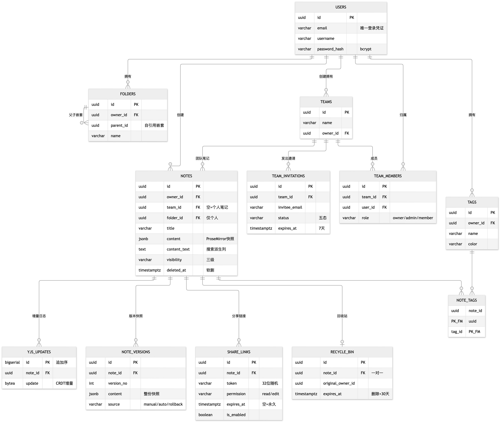
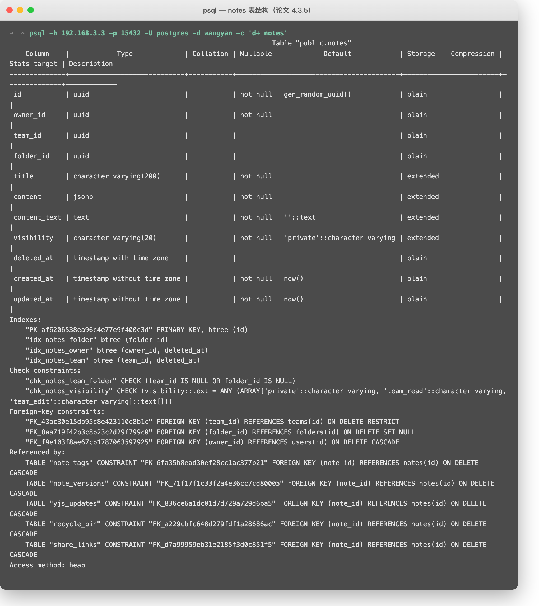
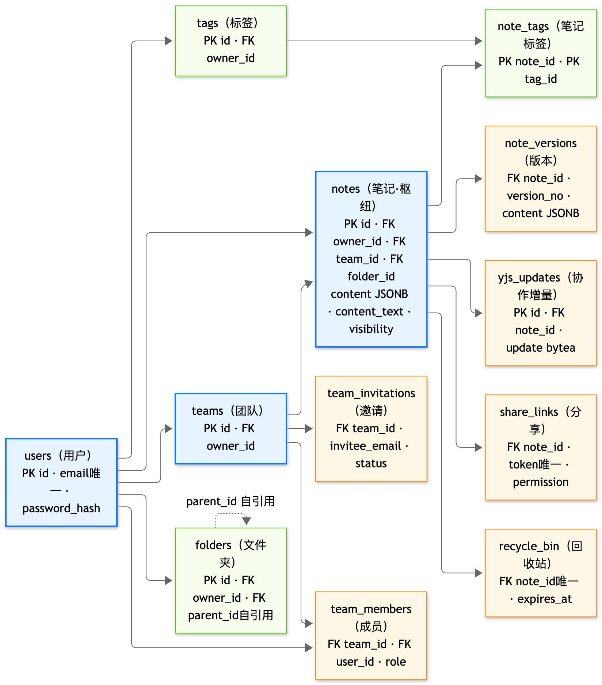
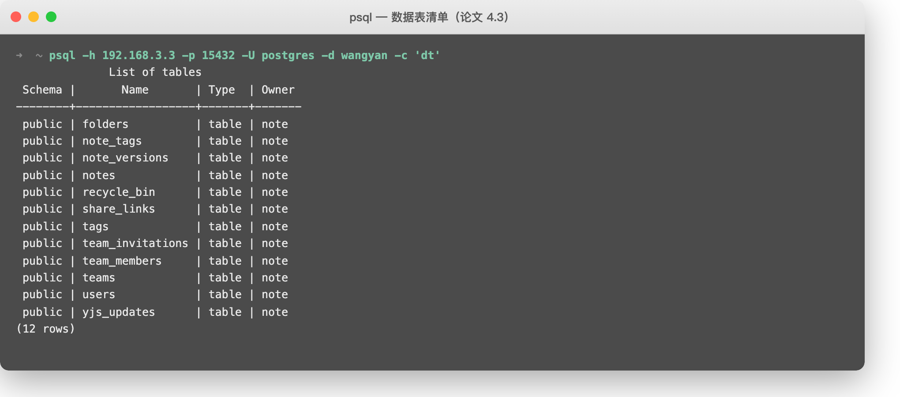
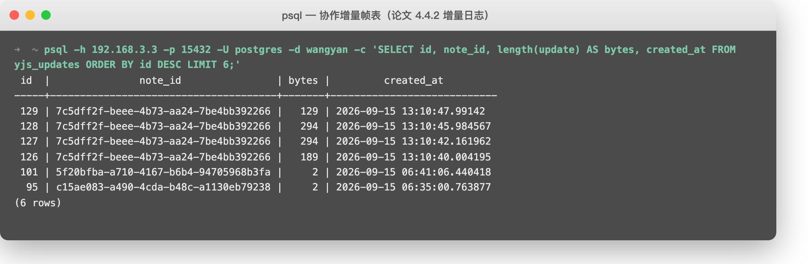
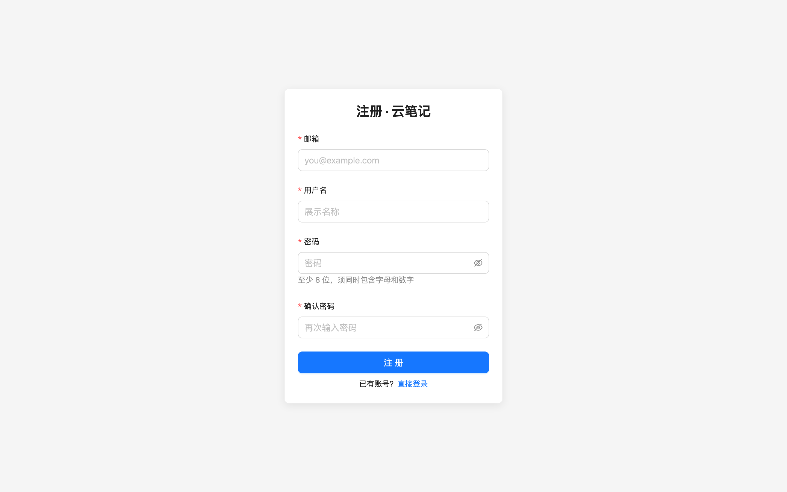
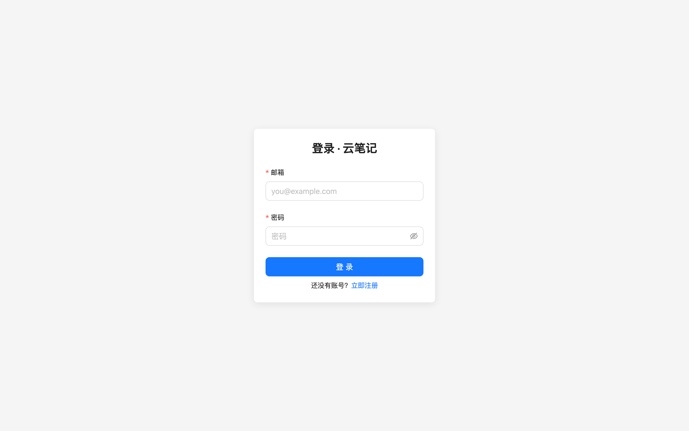
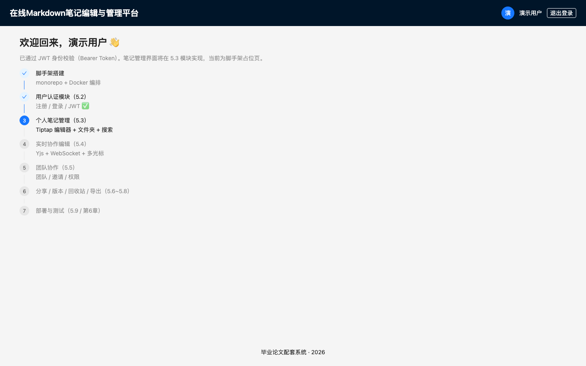

<!-- 论文初稿使用说明（转 Word 前删除本段）：
1. 本初稿由完整版 docs/thesis/thesis.md 裁剪生成（2026-09-17），进度呈现为"已过 1/3"：
   第 5 章保留 5.1 开发环境与 5.2 用户认证，5.3 起标注待实现；第 6 章为测试计划；第 7 章为阶段小结。
2. 图片链接为仓库相对路径（../assets/…），GitHub 可直接渲染；待实现模块无截图属正常。
3. 附录 A 全文在 docs/appendix-ddl.sql，转 Word 时整篇粘贴；附录 B/C 已内联。
-->

# 在线Markdown笔记编辑与管理平台的设计与实现

**摘要**

随着个人与团队知识沉淀需求的增长，传统笔记工具在“轻量记录”与“多人协作”之间往往难以兼顾：主流 Markdown 编辑器多以单机写作见长，而支持多人实时编辑的在线文档又普遍对 Markdown 语法支持有限。本文设计并实现一个在线 Markdown 笔记编辑与管理平台，采用 React 18 与 TypeScript 构建前端、NestJS 构建后端服务，以 PostgreSQL（笔记正文使用 JSONB 类型存储）与 Redis 作为数据存储与缓存层，并通过 Yjs（CRDT）与 WebSocket 实现多人实时协作编辑。系统规划覆盖用户管理、个人笔记管理、团队协作、实时协作编辑、笔记分享、版本管理与回收站七个功能模块，并支持 Markdown / PDF 双格式导出与 Docker 一键部署。截至本初稿提交，系统的需求分析与整体设计已经完成，开发环境与用户认证模块已实现并通过验证，个人笔记管理等其余模块正按计划推进，预计于 2026 年 10 月底完成全部功能开发并进入系统测试阶段。

**关键词**：Markdown；实时协作；CRDT；Yjs；NestJS；Docker

**Abstract**

With the growing demand for personal and team knowledge management, traditional note-taking tools can hardly balance lightweight writing and multi-user collaboration: mainstream Markdown editors focus on single-user writing, while online document tools with real-time co-editing usually provide limited Markdown support. This paper designs and implements an online Markdown note editing and management platform. The front end is built with React 18 and TypeScript, the back end with NestJS, using PostgreSQL (note content stored as JSONB) and Redis for persistence and caching, and Yjs (a CRDT library) with WebSocket for real-time collaborative editing. The system is planned to cover seven modules: user management, personal note management, team collaboration, real-time co-editing, note sharing, version management and recycle bin, with Markdown/PDF exporting and one-click Docker deployment. As of this draft, the requirement analysis and overall design have been completed; the development environment and the user authentication module have been implemented and verified, and the remaining modules are being developed on schedule, with all functions expected to be completed by the end of October 2026.

**Key words**: Markdown; Real-time Collaboration; CRDT; Yjs; NestJS; Docker

# 第1章 绪论

## 1.1 选题背景与意义

### 1.1.1 知识管理需求的兴起

近年来，随着互联网内容创作的普及与远程办公方式的流行，个人和团队都需要对日常产生的文字资料进行持续的记录、整理与复用。对个人而言，学习笔记、技术文档、工作记录分散在不同工具中，缺乏统一的组织方式；对团队而言，项目文档、会议纪要、经验总结需要多人共同维护，仅靠本地文件传输与合并极易产生版本混乱。一个支持分类管理、检索、版本追溯，并能在多人之间实时共享编辑的笔记平台，能够明显降低知识管理的成本，具有实际的应用价值。

### 1.1.2 Markdown在技术写作中的普及

Markdown 是一种轻量级标记语言，它用简单的符号（如 `#` 表示标题、`**` 表示加粗）描述文档结构，使作者可以专注于内容本身，而不必操作复杂的排版菜单。同时，Markdown 是纯文本格式，天然适合版本管理与跨平台流转，已被 GitHub、掘金、语雀等大量平台采纳为默认写作格式。在技术写作领域，Markdown 已经成为事实上的标准。因此，以 Markdown 作为笔记平台的核心编辑格式，既符合目标用户（开发者、学生、知识工作者）的既有习惯，也便于内容的导出与再利用。

### 1.1.3 实时协作编辑的发展趋势

从 Google Docs 到国内的腾讯文档、飞书文档，多人实时协作编辑已经成为在线文档产品的标配。用户期望“打开同一条链接就能一起编辑”，而不是反复传文件、手动合并。支撑这类体验的核心技术是并发控制算法：无论是 operational transformation（OT）还是 CRDT（无冲突复制数据类型），目标都是让多个参与者的编辑在无需中心锁的情况下最终收敛到一致。随着 Yjs 等成熟开源 CRDT 库的出现，中小型系统接入实时协作的门槛已大幅降低，这为本课题在毕业设计的规模上实现“多人实时协作的 Markdown 笔记平台”提供了技术可行性。

## 1.2 国内外研究现状

### 1.2.1 主流Markdown编辑器对比分析

目前主流的 Markdown 编辑工具可分为三类。第一类是单机编辑器，如 Typora、Obsidian、MarkText，其优点是响应快、功能完整，但内容保存在本地，协作需要借助第三方同步盘，无法做到多人同时编辑同一篇文档。第二类是在线知识库产品，如 Notion、语雀、飞书文档，协作能力强，但其编辑器多为私有富文本格式，对标准 Markdown 语法（尤其是表格、任务列表等）的支持并不完整，且数据托管在服务商的服务器上，导出与自主部署受限。第三类是开源自托管方案，如 HedgeDoc、Outline，功能上各有侧重，但整体上仍缺少“个人笔记管理 + 团队协作 + 访客分享 + 版本管理”一体化的能力。总体来看，市场缺少一个既能完整支持 Markdown、又具备实时协作能力、且可以私有化部署的轻量平台。

### 1.2.2 实时协作编辑技术研究现状

协同编辑的并发控制研究始于上世纪八十年代末。Ellis 与 Gibbs 提出的 GROVE 系统引入了操作变换（Operational Transformation，OT）[2]，此后 Sun 与 Ellis 对 OT 在群件编辑器中的算法问题进行了系统总结[3]。OT 的思路是对并发操作进行坐标变换，Google Docs 是其著名工程实践，但其正确性依赖复杂的变换函数证明，实现难度大。2011 年，Shapiro 等人提出了无冲突复制数据类型（CRDT）[1]，从数据结构层面保证多副本最终一致：只要所有副本收到相同的操作集合，无论到达顺序如何，状态都能自动收敛。Yjs 是 CRDT 思想在文档编辑领域的成熟开源实现[7]，配合 y-websocket 等传输层，开发者无需自行实现并发控制算法即可获得实时协作能力，这也是本文选用的技术路线。

### 1.2.3 现有系统存在的不足

综合上述分析，现有系统主要存在三点不足：其一，单机 Markdown 编辑器没有实时协作能力，多人协作场景退化 为“文件互传”；其二，在线协作文档产品对 Markdown 的支持不完整、不可私有部署，不满足技术写作用户对语法纯度与数据自主权的要求；其三，部分开源方案功能割裂，个人笔记的组织管理（文件夹、标签、搜索、回收站）与团队协作（权限、邀请、分享）往往不能兼顾。针对这些不足，本文设计并实现了一个功能完整、可私有部署的在线 Markdown 笔记编辑与管理平台。

## 1.3 本文主要研究内容

本文的研究内容是设计并实现一个在线 Markdown 笔记编辑与管理平台，主要工作包括：

（1）分析系统的功能需求与非功能需求，划分个人用户、团队管理员、团队成员、访客四类用户角色，确定七个功能模块的边界；

（2）完成系统总体架构设计、数据库设计、实时协作机制设计与多级权限控制设计，形成完整的系统设计方案；

（3）基于 React 18 + TypeScript + Ant Design、NestJS、PostgreSQL（JSONB）、Redis、Yjs + WebSocket、JWT、Docker 等技术完成系统实现，覆盖七个功能模块以及 Markdown/PDF 导出、容器化部署；

（4）对系统进行功能测试与性能测试，验证各模块功能的正确性与系统在并发协作场景下的性能表现。

## 1.4 论文组织结构

本文共分七章。第 1 章介绍选题背景、研究现状与主要研究内容；第 2 章介绍系统涉及的关键技术并给出必要的选型对比；第 3 章进行系统需求分析，包括可行性分析、用户角色、功能与非功能需求及用例分析；第 4 章给出系统设计方案，包括总体架构、功能模块、数据库、实时协作与权限控制设计；第 5 章按模块阐述系统实现过程与核心代码；第 6 章对系统进行功能、性能与兼容性测试并分析结果；第 7 章总结全文并展望后续改进方向。

# 第2章 相关技术概述

## 2.1 前端技术

### 2.1.1 React 18与TypeScript

React 是目前应用最广泛的前端框架之一[8]，其核心思想是“组件化”与“声明式渲染”：界面被拆分为可复用的组件，开发者只需描述“界面在给定状态下应当是什么样”，框架负责在状态变化时高效地更新页面。React 18 提供了并发渲染等能力，并配套 Hooks 机制，使函数组件能够方便地管理副作用（如网络请求、订阅 WebSocket）。TypeScript 在 JavaScript 的基础上增加了静态类型系统，接口的请求参数与响应结构、组件的属性均可在编码期得到类型检查，能在编译阶段提前发现大量低级错误。本项目前后端均使用 TypeScript，并借助 pnpm workspace 将共享类型抽取为公共包，保证了接口契约在前后端之间的一致性。

### 2.1.2 Ant Design UI组件库

Ant Design 是蚂蚁集团开源的企业级 React UI 组件库[12]，提供了表单、表格、弹窗、抽屉、消息提示等数十种高质量组件，以及统一的视觉规范。对于本系统这类以表单录入、列表管理、弹窗交互为主要形态的管理型应用，使用 Ant Design 可以避免重复造轮子，将开发精力集中在业务逻辑上。本系统的登录注册表单、笔记三栏工作台、团队管理弹窗、版本历史抽屉等界面均基于 Ant Design 构建。

### 2.1.3 Markdown编辑器选型（Tiptap / Vditor）

Markdown 编辑器是本系统的核心组件，候选方案为 Tiptap 与 Vditor 两者。Vditor 是一款开箱即用的中文 Markdown 编辑器，支持“所见即所得、即时渲染、分屏预览”三种模式，上手成本低；但它是一个封闭的整块组件，与外部协同库（尤其是 Yjs）缺乏成熟的集成方案，实时协作是其短板。Tiptap 基于 ProseMirror 构架[6]，采用“无头（Headless）”设计——编辑器只负责文档模型与交互，界面样式完全由使用者控制；更重要的是，ProseMirror 的文档模型可以通过 y-prosemirror 与 Yjs 文档直接绑定，官方生态成熟，是“富文本编辑器 + CRDT 协作”组合的事实标准。考虑到本系统的核心卖点是实时协作编辑，Tiptap 与 Yjs 的集成路径最短、风险最低，因此选用 Tiptap，Markdown 的输入与序列化分别通过其 input rules 机制与 tiptap-markdown 扩展补齐。

## 2.2 后端技术

### 2.2.1 NestJS框架与模块化设计

NestJS 是一个基于 Node.js 的企业级后端框架[9]，其设计大量借鉴了 Angular 的思想：以模块（Module）为组织单位，通过依赖注入（DI）管理服务之间的依赖，用装饰器声明控制器、路由与参数校验。NestJS 的模块机制天然适合“按业务域划分代码”——本系统的认证、笔记、团队、分享、实时协作、版本与回收站各自封装为一个模块，模块内部再按 controller / service 分层。需要说明的是，本系统在物理上是一个单体应用，但在模块划分上遵循了高内聚、低耦合的原则，各业务域通过接口协作，具备后续按需拆分的条件，本文将其表述为“模块化设计”。

### 2.2.2 RESTful API设计

REST 是一种以资源为中心的 Web API 架构风格[4]：将系统中的实体抽象为资源（如笔记、团队），用统一的 HTTP 动词表达对资源的操作——GET 查询、POST 创建、PATCH 部分更新、DELETE 删除，用 URL 路径表达资源的层级关系，用状态码表达操作结果（200 成功、201 已创建、400 参数错误、401 未认证、403 无权限、404 不存在、409 冲突）。本系统的接口均按 REST 规范设计，错误响应统一为 `{ statusCode, message }` 结构，完整接口清单见附录 C。

### 2.2.3 WebSocket实时通信协议

HTTP 是“请求—响应”模式，服务端无法主动向客户端推送数据，这使其无法满足“一端编辑、其他端立即看到”的实时性要求。WebSocket 是浏览器提供的全双工通信协议：客户端与服务端通过一次 HTTP 升级握手建立持久连接，之后双方均可主动发送消息，通信开销远低于 HTTP 轮询。本系统的实时协作建立在 WebSocket 之上：服务端在 HTTP 服务的 upgrade 事件上挂载 y-websocket 的连接处理逻辑，客户端与服务端之间以二进制协议交换文档增量与用户感知状态。

## 2.3 数据存储技术

### 2.3.1 PostgreSQL与JSONB数据类型

PostgreSQL 是功能完善的开源关系型数据库[10]，以标准兼容性好、扩展能力强著称。其独有的 JSONB 类型以二进制形式存储 JSON 文档，既支持 GIN 索引与丰富的查询操作符，又保留了关系表的约束与事务能力，适合存储“结构相对固定但内部结构灵活”的数据。本系统用 JSONB 存储笔记正文——正文采用 ProseMirror 文档 JSON 结构（含段落、标题、表格等嵌套节点），若拆成关系表存储会非常繁琐，JSONB 一列即可整存整取。对象关系映射采用 NestJS 官方集成的 TypeORM，实体以装饰器定义，开发期自动同步建表，最终导出建表 SQL 作为论文附录 A。

### 2.3.2 Redis缓存与会话管理

Redis 是基于内存的键值数据库[11]，读写性能高，并支持键过期机制，常用于缓存与会话管理。本系统使用 Redis 承担三类职责：一是 JWT 登出黑名单——用户登出后将其令牌标识（jti）写入 Redis 并设置与令牌剩余有效期相同的过期时间，实现“登出即失效”；二是分享链接元数据缓存，访客访问分享页是匿名高频操作，60 秒缓存可显著降低数据库压力，管理端变更时主动失效；三是定时任务的状态支撑。

## 2.4 实时协作技术

### 2.4.1 OT算法与CRDT算法比较

OT 与 CRDT 是协同编辑领域的两条主流技术路线。OT 的核心是在收到并发操作时，将其相对于本地已执行的操作序列进行变换，使操作在不同副本上产生一致效果；其优点是操作直观、历史简洁，缺点是变换函数的设计与正确性证明复杂，不同数据类型（文本、表格、富文本）都要单独推导。CRDT 则从数据结构入手，保证操作满足交换律、结合律与幂等性，副本之间无论以何种顺序、何种次数同步操作，最终状态必然一致[1]；其代价是数据结构携带额外元数据、内存占用略高。对于毕业设计的时间与验证条件而言，CRDT“结构保证正确性”的特性大幅降低了实现风险，且 Yjs 提供了与 ProseMirror 的成熟集成，因此本系统选用 CRDT 路线。

### 2.4.2 Yjs框架原理与应用

Yjs 是 JavaScript 生态中应用最广泛的 CRDT 库[7]。其核心数据结构 Y.Doc 是一个由若干共享类型（Y.Text、Y.Map、Y.XmlFragment 等）组成的文档容器，每次编辑产生一段二进制“增量（update）”，增量可以以任意顺序、任意次序合并而不产生冲突。围绕 Y.Doc，y-websocket 提供了服务端参考实现，负责连接管理、增量广播与状态向量同步；y-protocols/awareness 定义了光标位置、在线用户等“临时状态”的广播协议；y-prosemirror 则将 ProseMirror 编辑器文档与 Y.XmlFragment 双向绑定，使 Tiptap 的每次按键自动转化为 Yjs 增量。本系统的实时协作编辑模块即由这一整套组件构成。

## 2.5 系统部署技术

### 2.5.1 Docker容器化部署

Docker 是目前主流的容器化技术[13][14]，它将应用及其运行环境打包为镜像，以容器方式运行，从而消除“在我机器上能跑”的环境差异问题。本系统前后端各编写一个多阶段构建的 Dockerfile：构建阶段在完整的 Node 环境中编译代码，运行阶段仅携带编译产物（服务端基于 node:22-alpine，前端基于 nginx:alpine），显著减小镜像体积并降低攻击面。

### 2.5.2 Docker Compose多服务编排

本系统的完整运行依赖 PostgreSQL、Redis、后端服务、前端四个服务，逐一手动启动既繁琐也不利于演示。Docker Compose 通过一份 YAML 文件声明各服务的镜像、端口、环境变量、依赖关系与健康检查，`docker compose up` 一条命令即可拉起全部服务，实现一键启动。本系统的编排文件见附录 B。

# 第3章 系统需求分析

## 3.1 系统可行性分析

### 3.1.1 技术可行性

本系统采用的技术栈均为业界成熟的开源技术：React、NestJS、PostgreSQL、Redis、Docker 拥有完善的文档与社区支持；实时协作所依赖的 Yjs 及其配套传输层 y-websocket 是经过大量生产项目验证的开源方案，配合官方推荐的服务端参考实现，可以将开发精力集中在业务逻辑与持久化设计上。开发环境方面，使用一台常驻局域网的 NAS 设备运行数据库与 Redis 容器，开发机通过 pnpm workspace 组织前后端代码，工具链简单。综上，系统在技术上完全可行。

### 3.1.2 经济可行性

本系统为毕业设计作品，开发工作由本人独立完成，无人力成本。全部依赖均为开源软件，无授权费用。系统对硬件要求低：演示环境复用一台已有的 NAS 设备（4 核处理器、62GB 内存）运行四个 Docker 容器，开发环境使用一台 Mac mini，均无需额外采购。后期维护工作可由使用者承担，不需要专职运维。经济上可行。

### 3.1.3 操作可行性

系统采用 B/S 架构，用户无需安装任何客户端，通过浏览器即可完成全部操作。界面基于 Ant Design 的通用交互模式构建：左侧文件夹树 + 笔记列表 + 编辑区的三栏工作台符合主流笔记软件的使用习惯；团队管理、分享设置等低频功能收纳在弹窗与抽屉中，不干扰主流程。访客通过分享链接访问时无需注册账号。对目标用户（具备基本计算机使用经验的办公与学习人群）而言，操作上完全可行。

## 3.2 系统用户角色分析

系统按使用场景划分为四类用户角色，如表 3-1 所示。

**表 3-1 系统用户角色**

| 角色 | 说明 | 主要操作 |
|---|---|---|
| 个人用户 | 系统的普通注册用户 | 注册登录、创建文件夹与标签、编辑个人笔记、实时协作、导出、版本管理、删除与恢复笔记 |
| 团队管理员 | 团队的创建者或被授权的管理者 | 创建/解散团队、邀请与移除成员、审批邀请、调整成员角色、管理团队笔记的可见性 |
| 团队成员 | 接受邀请加入团队的用户 | 查看团队内对其可见的笔记、编辑“可编辑”级别的团队笔记、退队 |
| 访客 | 持有分享链接的匿名用户 | 凭链接查看笔记内容；持“可编辑”链接时可进入实时协作一起编辑 |

## 3.3 功能需求分析

### 3.3.1 用户管理模块

用户管理模块负责系统的身份体系，包括：用户注册（邮箱与用户名唯一性校验、密码强度校验）、用户登录（校验通过后签发 JWT 令牌）、登录状态维持与登出（登出后令牌立即失效）以及个人信息查询。所有需要登录的接口均通过统一的认证守卫校验令牌。

### 3.3.2 个人笔记管理模块

个人笔记管理模块是系统的主体，包括：笔记的创建、编辑、删除（软删除）；编辑过程中的自动保存；Markdown 语法的即时渲染预览；文件夹（支持多级嵌套）与标签两个维度的分类管理；基于关键词的笔记搜索（覆盖标题与正文）。

### 3.3.3 团队协作管理模块

团队协作管理模块面向多人共同维护文档的场景，包括：团队的创建、信息维护与解散；通过邮箱邀请成员，被邀请人接受或拒绝邀请，邀请人可撤回，邀请过期自动失效；成员角色管理（所有者/管理员/普通成员）；团队笔记的可见性分级（私有/成员只读/成员可编辑）与权限校验。

### 3.3.4 实时协作编辑模块

实时协作编辑模块使多个用户能够同时编辑同一篇笔记，包括：基于 WebSocket 的连接建立与鉴权；文档内容的实时双向同步；多用户光标位置与姓名标签的同步展示（在线感知）；并发编辑冲突的自动合并，保证所有客户端最终看到一致的内容。

### 3.3.5 笔记分享模块

笔记分享模块支持将笔记以链接形式分享给未注册的访客，包括：分享链接的生成（可选择只读或可编辑权限、可设置有效期）；链接的公开访问（访客无需登录）；链接的停用、改期与删除；可编辑链接的访客可直接进入实时协作。链接处于停用、过期或伪造状态时统一返回“不存在”，防止链接被枚举探测。

### 3.3.6 版本管理模块

版本管理模块为笔记提供历史快照能力，包括：手动保存版本；编辑会话结束且有变更时自动保存版本；版本列表与快照查看；一键回滚到指定版本，回滚前当前状态自动留档。

### 3.3.7 回收站模块

回收站模块兜底笔记的误删除，包括：删除的笔记进入回收站并保留 30 天；回收站列表展示剩余保留天数；恢复笔记（放回原文件夹）；彻底删除（关联的版本、分享链接、协作增量一并清除）；到期笔记由定时任务自动清理。

## 3.4 非功能需求分析

### 3.4.1 性能需求

常规接口在局域网环境下的平均响应时间应控制在 100 毫秒以内，保证操作“无感等待”；实时编辑的键入传播延迟应控制在肉眼不可察的水平（毫秒级）；系统应能支撑毕业设计演示规模的并发协作（数十路并发连接），并具备水平扩展的余地。

### 3.4.2 安全性需求

安全性需求包括：用户密码不得明文存储，须使用 bcrypt 等自适应哈希算法；认证采用 JWT，登出后令牌须立即失效；接口须防止越权访问，用户只能访问自己有权访问的资源，且“资源不存在”与“无权访问”统一返回 404，不暴露资源存在性；分享链接的令牌须具备足够的随机强度；对外部输入进行校验与转义，防止 SQL 注入。

### 3.4.3 可用性需求

系统应支持 Docker Compose 一键启动，降低部署门槛；界面遵循通用交互习惯，提供操作结果反馈（保存状态提示、错误提示）；误删除的笔记可通过回收站找回；核心数据（笔记正文、协作增量、版本快照）应保证不因异常会话而丢失或被覆盖。

## 3.5 系统用例分析

### 3.5.1 系统总体用例图

系统总体用例如图 3-1 所示，四类角色与用例的关系为：个人用户覆盖全部个人空间用例；团队管理员与团队成员的用例限定在团队空间；访客仅与分享访问用例关联；实时协作编辑用例为个人用户、团队成员与“可编辑”访客所共享。

【待插图 图 3-1 系统总体用例图。画图要点：四个参与者（个人用户、团队管理员、团队成员、访客）；用例椭圆分四组——账号类（注册、登录、登出），笔记类（新建/编辑/搜索/分类管理、导出、版本管理、回收站），团队类（创建团队、邀请审批、成员与权限管理、团队笔记管理），分享与协作类（生成分享链接、访客访问、实时协作编辑）；协作编辑用例与个人用户、团队成员、访客三条连线。】

### 3.5.2 用户管理用例

用户管理用例包括：注册（填写邮箱、用户名、密码，系统校验唯一性与格式后创建账号）、登录（校验通过后获得令牌）、退出登录（当前令牌立即失效）、查看个人信息。异常路径包括：重复邮箱/用户名注册返回冲突提示，密码强度不足被表单与后端双重拦截，错误凭据登录统一提示“邮箱或密码错误”。

### 3.5.3 笔记管理用例

笔记管理用例包括：新建笔记、编辑正文与标题（自动保存）、移动至文件夹、打标签、关键词搜索、导出 Markdown/PDF、保存版本、回滚版本、删除（进回收站）、从回收站恢复、彻底删除。前置条件为用户已登录且笔记归属本人（或团队权限满足）。

### 3.5.4 团队协作用例

团队协作用例包括：创建团队（创建者自动成为所有者）、编辑团队信息、解散团队；邀请成员（按邮箱发出，7 天有效）、接受/拒绝邀请、撤回邀请；调整成员角色、移除成员、退出团队；在团队空间创建笔记并设置可见性、按权限查看与编辑团队笔记。

### 3.5.5 实时编辑用例

实时编辑用例包括：打开笔记建立协作连接（鉴权通过）、多用户同时编辑同一笔记（内容实时同步）、查看协作者光标与在线状态、并发编辑后内容自动收敛一致、断开连接后内容持久化。异常路径包括：无令牌/伪造令牌/越权连接被拒绝（401），只读权限的访客连接被拒绝以防止写穿。

# 第4章 系统设计

## 4.1 系统架构设计

### 4.1.1 总体架构设计

系统在逻辑上分为四层，如图 4-1 所示：表现层为 React 单页应用，通过浏览器访问；网关层由 Nginx 承担，托管前端静态资源并将 `/api` 与 `/ws` 请求反向代理到后端；应用层为 NestJS 模块化单体，REST 接口与 WebSocket 服务共进程部署，内部按业务域划分为九个模块；数据层由 PostgreSQL（业务数据，正文 JSONB 存储、协作增量二进制存储）与 Redis（令牌黑名单、分享缓存）组成。

【待插图 图 4-1 系统总体架构图。画图要点：自上而下四层——浏览器（React SPA）→ Nginx（静态资源 + /api、/ws 反代）→ NestJS 应用（auth/users/notes/teams/share/versions/recycle-bin/realtime/export 九个模块框）→ PostgreSQL（notes.content=JSONB、yjs_updates=bytea）与 Redis；标注 REST 与 WebSocket 两条通路，WebSocket 通路注明“upgrade 握手鉴权”。】

### 4.1.2 前后端分离架构

系统采用前后端分离架构：前端以 Vite 构建的静态资源独立部署于 Nginx，后端仅提供 RESTful API 与 WebSocket 服务，两者通过 JSON 格式的 HTTP 报文通信，仅以数据接口产生耦合。这种结构带来的好处是：前后端可以并行开发、独立部署与扩展；前端作为纯静态资源可由 CDN 或任意静态服务器承载；接口契约由共享类型包约束，保证两端一致。

### 4.1.3 后端模块化设计

后端虽为单体部署，但按“模块化设计”原则组织代码：每个业务域对应一个 NestJS Module（auth、users、notes、teams、share、versions、recycle-bin、realtime、export），模块内部按 controller—service—repository 分层，模块之间仅通过显式导出的 Service 交互。这种划分使每个模块的职责单一、边界清晰，代码结构可以直接映射到论文的功能模块小节，也为未来按需拆分为独立服务保留了可能。

## 4.2 系统功能模块设计

### 4.2.1 系统功能结构图

系统功能结构如图 4-2 所示，顶层为平台，向下分为七个功能模块，与第 3 章的功能需求一一对应；其中笔记导出功能挂接在笔记管理与分享访问两个入口上。

【待插图 图 4-2 系统功能结构图。画图要点：树状结构——根节点“在线Markdown笔记编辑与管理平台”，七个一级子节点（用户管理、个人笔记管理、团队协作管理、实时协作编辑、笔记分享、版本管理、回收站），各一级节点下挂 3.3 节所列的具体功能叶子。】

### 4.2.2 用户认证模块设计

认证模块采用 JWT 无状态认证。注册时对邮箱格式、用户名长度、密码强度做前后端双重校验，密码经 bcrypt（10 轮加盐）哈希后入库；登录成功后签发载荷为 `{ sub, username, jti, exp }` 的 HS256 令牌，其中 jti 为令牌唯一标识。登出时将 `auth:denylist:{jti}` 写入 Redis、过期时间与令牌剩余寿命一致，认证守卫在每次请求时先查黑名单再放行，从而以无状态令牌实现了“登出即失效”。

### 4.2.3 笔记管理模块设计

笔记管理模块以 notes 表为核心（见 4.3.5），对外提供笔记 CRUD、文件夹、标签、搜索四组接口。设计要点有三：其一，正文 content 采用 ProseMirror 文档 JSON（JSONB 存储），保存时由服务端派生纯文本列 content_text 供搜索使用；其二，删除采用软删除——置 deleted_at 标记并写入回收站元数据，业务查询一律过滤已删标记；其三，前端编辑以 800 毫秒防抖自动保存，空标题由服务端兜底为“未命名笔记”。

### 4.2.4 团队协作模块设计

团队协作模块围绕“团队—成员—邀请—团队笔记”四个实体展开。团队创建者在成员表中登记为 owner 角色；邀请按邮箱发出、有效期 7 天，邀请（team_invitations）与成员（team_members）拆分为两个实体，因为“待审批的邀请”与“正式成员”生命周期不同：邀请可撤回、可拒绝、可过期，只有接受的邀请才转化为成员记录。团队笔记通过 visibility 字段实现成员级可见性控制，权限判定集中在服务层的角色断言函数中实现（见 4.5）。

### 4.2.5 实时编辑模块设计

实时编辑模块由服务端的 WebSocket 接入、文档持久化与客户端的 Yjs 集成两部分构成，核心机制在 4.4 节单独阐述。设计上需要特别处理的是实时数据与持久化数据的分工：实时协作以 yjs_updates 增量日志为数据源，而列表、搜索、导出、版本等离线功能读取 notes.content 快照，两者由持久化适配器按“会话结束合并回写”的策略衔接。

### 4.2.6 分享与权限模块设计

分享模块以 share_links 表记录链接凭证：token 由密码学安全随机数生成（32 位十六进制），是访客访问的唯一凭证；permission 字段决定访客是只读还是可编辑；expires_at 与 is_enabled 分别控制时间维度的有效期与人工停用。公开解析接口对“停用、过期、笔记已删、伪造 token”四种情况统一返回 404，防止链接枚举；元数据经 60 秒 Redis 缓存加速，管理端任何变更即时失效缓存。可编辑链接的访客凭 token 通过 WebSocket 握手鉴权后与登录用户进入同一协作会话。

## 4.3 数据库设计

### 4.3.1 数据库E-R图设计

系统的概念模型以用户、团队、笔记三个实体为中心，如图 4-3 所示。主要联系包括：用户与文件夹、笔记、版本、分享链接之间为一对多；用户与团队之间存在“拥有”与“属于”两条联系（后者经团队成员表带角色属性，为多对多）；团队与团队笔记为一对多；笔记与回收站记录为一对一；笔记与标签经关联表构成多对多。



**图 4-3 系统E-R图**

### 4.3.2 用户表（users）

用户表存储账号基础信息，如表 4-1 所示。密码仅保存 bcrypt 哈希，全库不落明文。

**表 4-1 用户表（users）**

| 字段名 | 字段描述 | 数据类型 | 是否主键 | 可否为空 |
|---|---|---|---|---|
| id | 用户ID | uuid | 是 | NOT NULL |
| email | 登录邮箱 | varchar(255) | 否 | NOT NULL（唯一） |
| username | 用户名 | varchar(50) | 否 | NOT NULL（唯一） |
| password_hash | 密码哈希 | varchar(100) | 否 | NOT NULL |
| avatar_url | 头像地址 | varchar(500) | 否 | NULL |
| created_at / updated_at | 创建/更新时间 | timestamptz | 否 | NOT NULL |

### 4.3.3 团队表（teams）

团队表记录团队基本信息，如表 4-2 所示。owner_id 指向创建者，同时创建者在 team_members 表中登记 owner 角色，两者的一致性由服务层保证，属于受控冗余（见 4.3.9 反规范化说明）。

**表 4-2 团队表（teams）**

| 字段名 | 字段描述 | 数据类型 | 是否主键 | 可否为空 |
|---|---|---|---|---|
| id | 团队ID | uuid | 是 | NOT NULL |
| name | 团队名称 | varchar(100) | 否 | NOT NULL |
| description | 团队简介 | varchar(500) | 否 | NULL |
| owner_id | 创建者ID | uuid（外键→users） | 否 | NOT NULL |
| created_at / updated_at | 创建/更新时间 | timestamptz | 否 | NOT NULL |

### 4.3.4 团队成员表（team_members）

团队成员表承载用户与团队的多对多关系及角色属性，如表 4-3 所示。同一团队内（team_id, user_id）唯一；role 取值 owner / admin / member，是 RBAC 模型的落点。与之配套的团队邀请表（team_invitations）记录按邮箱发出的邀请及其状态（pending / accepted / declined / cancelled / expired）与 7 天有效期，仅“accepted”的邀请转化为成员记录。

**表 4-3 团队成员表（team_members）**

| 字段名 | 字段描述 | 数据类型 | 是否主键 | 可否为空 |
|---|---|---|---|---|
| id | 记录ID | uuid | 是 | NOT NULL |
| team_id | 团队ID | uuid（外键→teams） | 否 | NOT NULL |
| user_id | 用户ID | uuid（外键→users） | 否 | NOT NULL |
| role | 角色 | varchar(20)，CHECK 限定 owner/admin/member | 否 | NOT NULL，默认 member |
| joined_at | 加入时间 | timestamptz | 否 | NOT NULL |

### 4.3.5 笔记表（notes）

笔记表是全库枢纽，如表 4-4 所示。team_id 为空表示个人笔记、非空表示团队笔记；folder_id 仅个人笔记使用（数据库 CHECK 约束保证团队笔记不挂个人文件夹）；content 以 JSONB 存储 ProseMirror 文档快照；content_text 为服务端派生的纯文本列，用于关键词检索；visibility 控制团队笔记的成员级可见性；deleted_at 为软删标记。围绕笔记表还有四张支撑表：folders（文件夹，自引用支持嵌套）、tags 与 note_tags（标签多对多）、yjs_updates（协作增量日志，二进制追加式存储，见 4.4.2）。该表在真实数据库中的结构如图 4-4 所示。

**表 4-4 笔记表（notes）**

| 字段名 | 字段描述 | 数据类型 | 是否主键 | 可否为空 |
|---|---|---|---|---|
| id | 笔记ID | uuid | 是 | NOT NULL |
| owner_id | 创建者ID | uuid（外键→users） | 否 | NOT NULL |
| team_id | 所属团队 | uuid（外键→teams） | 否 | NULL |
| folder_id | 所属文件夹 | uuid（外键→folders） | 否 | NULL |
| title | 标题 | varchar(200) | 否 | NOT NULL |
| content | 正文快照 | jsonb | 否 | NOT NULL |
| content_text | 正文纯文本 | text | 否 | NOT NULL，默认 '' |
| visibility | 可见性 | varchar(20)，CHECK 限定 private/team_read/team_edit | 否 | NOT NULL，默认 private |
| deleted_at | 软删时间 | timestamptz | 否 | NULL |
| created_at / updated_at | 创建/更新时间 | timestamptz | 否 | NOT NULL |



**图 4-4 notes 表真实结构（psql \\d+ notes）**

### 4.3.6 笔记版本表（note_versions）

版本表保存笔记的历史快照，如表 4-5 所示。每条记录整份保存快照时的标题与正文（JSONB），version_no 在笔记内递增；source 标记快照来源（manual 手动 / auto 编辑会话结束自动 / rollback 回滚前留档），三者共同构成“手动 + 关键事件”的快照策略。

**表 4-5 笔记版本表（note_versions）**

| 字段名 | 字段描述 | 数据类型 | 是否主键 | 可否为空 |
|---|---|---|---|---|
| id | 版本ID | uuid | 是 | NOT NULL |
| note_id | 笔记ID | uuid（外键→notes） | 否 | NOT NULL |
| version_no | 版本号 | int | 否 | NOT NULL（笔记内唯一） |
| title | 快照标题 | varchar(200) | 否 | NOT NULL |
| content | 快照正文 | jsonb | 否 | NOT NULL |
| source | 快照来源 | varchar(20)，CHECK 限定 manual/auto/rollback | 否 | NOT NULL，默认 manual |
| created_by / created_at | 创建人/时间 | uuid / timestamptz | 否 | NOT NULL |

### 4.3.7 分享链接表（share_links）

分享链接表如表 4-6 所示。token 为链接 URL 中暴露的唯一凭证，由 crypto 模块的安全随机数生成，32 位十六进制；expires_at 为空表示永久有效；is_enabled 支持不等到期即时停用；visit_count 记录访问次数。

**表 4-6 分享链接表（share_links）**

| 字段名 | 字段描述 | 数据类型 | 是否主键 | 可否为空 |
|---|---|---|---|---|
| id | 链接ID | uuid | 是 | NOT NULL |
| note_id | 笔记ID | uuid（外键→notes） | 否 | NOT NULL |
| token | 访问令牌 | varchar(32)，唯一 | 否 | NOT NULL |
| permission | 访客权限 | varchar(20)，CHECK 限定 read/edit | 否 | NOT NULL，默认 read |
| expires_at | 过期时间 | timestamptz | 否 | NULL（永久） |
| is_enabled | 是否启用 | boolean | 否 | NOT NULL，默认 true |
| visit_count | 访问次数 | int | 否 | NOT NULL，默认 0 |
| created_by / created_at | 创建人/时间 | uuid / timestamptz | 否 | NOT NULL |

### 4.3.8 回收站表（recycle_bin）

回收站表记录删除动作的元数据，如表 4-7 所示。设计上笔记本体不搬家——删除仅置 notes.deleted_at 标记，回收站表只记录“谁删的、何时删的、何时到期”，这样 share_links、note_versions 等以 note_id 为外键的关联数据不会因“搬表”而断裂；恢复即清除软删标记并删除本记录，彻底删除则由外键级联一并清除关联数据。

**表 4-7 回收站表（recycle_bin）**

| 字段名 | 字段描述 | 数据类型 | 是否主键 | 可否为空 |
|---|---|---|---|---|
| id | 记录ID | uuid | 是 | NOT NULL |
| note_id | 笔记ID | uuid（外键→notes），唯一 | 否 | NOT NULL |
| original_owner_id | 原属主 | uuid（外键→users） | 否 | NOT NULL |
| original_folder_id | 原文件夹 | uuid | 否 | NULL |
| deleted_by | 删除人 | uuid（外键→users） | 否 | NOT NULL |
| deleted_at | 删除时间 | timestamptz | 否 | NOT NULL |
| expires_at | 到期时间 | timestamptz（删除 + 30 天） | 否 | NOT NULL |

### 4.3.9 数据库关系图

全库共 12 张基表，以 notes 为枢纽辐射展开，实体间外键关系如图 4-5 所示；除正文各表外，还包括 folders、tags、note_tags、yjs_updates、team_invitations 五张支撑表（设计稿中的 attachments 表因大纲未含附件功能未建），业务 CRUD 全部走基表。真实数据库的建表清单如图 4-6 所示。



**图 4-5 数据库关系图（外键关系）**



**图 4-6 真实库建表清单（psql \\dt）**

关于范式：全库满足第三范式，另有四处有意为之的受控反规范化，均在设计中主动交代——notes.content_text 派生列（搜索载体，保存时同步维护）、recycle_bin 的删除时刻快照（记录历史事实）、note_versions 整份快照（版本管理的本质）、团队所有者的双重表达（统一“我的团队”查询路径）。

## 4.4 实时协作设计

### 4.4.1 WebSocket连接管理

浏览器端 WebSocket 无法自定义请求头，因此 JWT 令牌经查询参数传递，服务端在 HTTP 服务的 upgrade 握手阶段完成鉴权：先校验令牌有效性，再校验用户对该笔记的访问权限，任一失败即返回 401 并拒绝连接。连接建立后由 y-websocket 负责心跳保活、增量广播与断连清理；当一篇笔记的最后一个连接断开时，服务端执行会话收尾（合并回写与压缩，见 4.4.2）。WebSocket 与 REST 接口共进程、共端口部署，经 Nginx 以同一路径规则反代，部署结构保持简单。

### 4.4.2 Yjs文档同步机制

文档同步采用“增量日志 + 快照”双轨设计，数据流如图 4-7 所示。打开文档时，服务端按自增序回放 yjs_updates 表中的历史增量；若该笔记从未有过协作会话，则从 notes.content 快照“播种”出初始 Yjs 文档并存入种子帧。协作过程中，每帧实时增量先在内存缓冲 2 秒、以 Y.mergeUpdates 合并为一帧后追加入库，避免逐键写行。最后一个连接断开时，将内存文档合并回写 notes.content 与 content_text，并压缩（compaction）已合并的旧增量行。为防止异常会话破坏数据，回写前执行防误清检查：若会话文档为空而库中快照非空，则跳过回写。增量广播走内存路径，与持久化完全异步，保证键入传播不受落盘耗时影响。协作增量帧在数据库中的实际存储形态如图 4-8 所示。

【待插图 图 4-7 Yjs文档同步流程图。画图要点：泳道图（客户端 A / 客户端 B / 服务端）；打开文档→回放增量或播种→实时编辑→增量广播→2 秒缓冲合并入库→末连接断开→合并回写快照+压缩；标注“防误清检查”分支。】



**图 4-8 协作增量帧表（yjs_updates）实拍**

### 4.4.3 光标同步与用户感知

多用户感知基于 y-protocols 的 awareness 协议：每个客户端通过 awareness 状态广播本地的用户名、显示颜色与光标的相对位置，服务端在协作参与者之间转发。前端将收到的远端光标渲染为带姓名标签的彩色光标，并在状态栏显示当前在线人数，使参与者能够直观感知“还有谁在编辑、正在编辑哪里”。

### 4.4.4 冲突解决策略

并发冲突由 Yjs 的 YATA 算法在数据结构层面解决：每次编辑生成携带因果元数据的增量操作，操作满足交换、结合与幂等性质，因此两个客户端无论以何种顺序收到对方的操作，最终文档状态必然收敛一致。这一保证使系统无需引入中心锁或人工合并界面——并发编辑后各客户端的文档内容自动一致（该性质将在第 6 章以双客户端并发编辑实验验证）。

## 4.5 权限控制设计

### 4.5.1 RBAC权限模型设计

系统采用基于角色的访问控制（RBAC）模型，角色与用户的映射关系直接落在数据表上，如表 4-8 所示。团队维度设 owner / admin / member 三级角色（存于 team_members.role）；个人空间以资源归属判定；访客以有效分享令牌判定。权限校验集中在服务层的角色断言函数中实现，避免判定逻辑散落各处。

**表 4-8 角色判定条件**

| 角色 | 判定条件 |
|---|---|
| 个人用户 | 笔记 owner_id 为本人且 team_id 为空 |
| 团队管理员 | team_members.role 为 owner 或 admin |
| 团队成员 | team_members.role 为 member，叠加笔记 visibility 判定读写 |
| 访客 | share_links.token 有效（未过期且已启用），permission 决定读/写 |

### 4.5.2 笔记级权限控制

对单篇笔记的访问权限按“所有者 > 团队管理员 > 可编辑成员 > 只读成员”四级矩阵判定：所有者与团队管理员拥有全部权限；visibility 为 team_edit 的团队笔记对普通成员可编辑，team_read 仅可读；private 仅所有者与管理员可见。对不可见的笔记一律返回 404，不区分“不存在”与“无权访问”，防止资源存在性泄露。

### 4.5.3 团队级权限控制

团队维度的权限约束成员管理行为：仅 owner 可调整成员角色与解散团队；owner/admin 可邀请、移除成员、撤回邀请；member 仅可退队。普通成员不可见私有团队笔记。所有团队接口在进入业务逻辑前先断言角色，权限不足返回 403。

### 4.5.4 分享链接权限控制

分享令牌本身即访客的临时身份凭证：read 链接的访客只能通过公开接口读取快照；edit 链接的访客可凭 token 通过 WebSocket 握手鉴权进入实时协作，与登录用户同场编辑。为防止“只读访客写穿数据”，WebSocket 层对 read 链接的连接请求直接拒绝——因为在纯 CRDT 广播模型中服务端无法约束客户端“只读”，最安全的做法是不放行。分享权限的设置与变更仅限笔记所有者或团队 owner/admin，保证“分享是扩权动作，由有权管理笔记的人执行”。

## 4.6 系统接口设计

系统接口按资源分组设计，全部遵循统一的请求/响应约定，完整接口清单见附录 C，此处列出各组的代表性接口。

### 4.6.1 用户认证接口

认证接口共四个：`POST /auth/register` 注册（201 返回脱敏用户，409 邮箱/用户名冲突）、`POST /auth/login` 登录（200 返回 access_token 与用户信息，401 统一错误文案）、`POST /auth/logout` 登出（令牌写入 Redis 黑名单）、`GET /users/me` 当前用户信息。

### 4.6.2 笔记管理接口

笔记组接口覆盖 CRUD 与子资源：`POST /notes` 新建、`GET /notes` 列表与搜索（支持 folder_id、tag_id、keyword 参数）、`GET /notes/:id` 详情、`PATCH /notes/:id` 更新（自动保存调用）、`DELETE /notes/:id` 软删除；文件夹组（`/folders`）与标签组（`/tags`）提供分类维度管理；分享组（`/share`）提供链接生成与停用/改期/删除管理；版本组（`/notes/:id/versions`）提供快照保存、查询与回滚；回收站组（`/recycle-bin`）提供列表、恢复与彻底删除。

### 4.6.3 团队管理接口

团队组接口包括团队 CRUD（`/teams`）、成员管理（`/teams/:id/members`）、邀请流程（`/teams/:id/invitations` 发起/撤回、`/teams/invitations/:iid/accept|decline` 接受/拒绝）与团队笔记（`/teams/:id/notes`），权限矩阵如 4.5.3 所述。

### 4.6.4 WebSocket事件定义

协作连接地址为 `ws://<host>/ws/{noteId}?token=<JWT>`（访客为 `?share=<token>`），握手期完成鉴权。连接后的消息采用 y-protocols 二进制协议，共两类事件，如表 4-9 所示。

**表 4-9 WebSocket 消息类型**

| type | 名称 | 方向 | 说明 |
|---|---|---|---|
| 0 | Sync | 双向 | 同步握手（交换状态向量、补齐差量）与实时增量广播，冲突收敛由 Yjs YATA 算法保证 |
| 1 | Awareness | 双向 | 用户感知状态（用户名、颜色、光标位置），多光标与在线人数的数据源 |

# 第5章 系统实现

截至本初稿提交，系统已完成开发环境搭建与用户认证模块的实现，数据层 12 张表已按第 4 章设计建库，个人笔记管理模块正在开发中。各模块的实现进度计划如表 5-1 所示，后续完成情况将持续更新本稿。

**表 5-1 实现进度计划**

| 模块（对应小节） | 状态 | 计划完成时间 |
|---|---|---|
| 开发环境与工具（5.1） | ✅ 已完成 | 2026 年 9 月上旬 |
| 用户认证模块（5.2） | ✅ 已完成 | 2026 年 9 月上旬 |
| 个人笔记管理模块（5.3） | 🟨 进行中 | 2026 年 9 月下旬 |
| 实时协作编辑模块（5.4） | ⬜ 待实现 | 2026 年 10 月上旬 |
| 团队协作模块（5.5） | ⬜ 待实现 | 2026 年 10 月中旬 |
| 笔记分享模块（5.6） | ⬜ 待实现 | 2026 年 10 月中旬 |
| 版本管理与回收站（5.7） | ⬜ 待实现 | 2026 年 10 月下旬 |
| 笔记导出功能（5.8） | ⬜ 待实现 | 2026 年 10 月下旬 |
| 系统部署（5.9） | ⬜ 待实现 | 2026 年 11 月上旬 |

## 5.1 开发环境与工具

### 5.1.1 开发环境配置

开发环境为 Mac mini（Apple Silicon），工具链包括 Node.js 22 与 pnpm 11；数据库与 Redis 以 Docker 容器运行于局域网 NAS 设备（PostgreSQL 16 端口 15432、Redis 7 端口 16379），开发机经环境变量直连，本地无需运行任何容器。开发期前后端以并行模式启动，前端 Vite 热更新、后端 NestJS watch 模式。代码仓库采用 pnpm workspace 组织：`apps/web`（前端）、`apps/server`（后端）、`packages/shared`（前后端共享的 TypeScript 类型与 DTO），共享包保证接口契约单一来源。

### 5.1.2 项目目录结构

后端按业务域组织模块，`apps/server/src/modules/` 下一个目录对应论文一个模块（auth、users、notes、teams、share、versions、recycle-bin、realtime、export），模块内部按 controller/service/entity 分层；前端页面按“登录注册、工作台（笔记管理与协作主界面）、分享页、打印页”四个入口组织，协作逻辑独立为 `src/collaboration/` 层。目录结构如图 5-1 所示。

```
wangyan-2026/
├─ apps/
│  ├─ web/            # 前端 React 18 + Vite + Ant Design
│  │  └─ src/{pages, components, collaboration, auth, utils}
│  └─ server/         # 后端 NestJS
│     └─ src/modules/{auth, users, notes, teams, share,
│                     versions, recycle-bin, realtime, export}
├─ packages/shared/   # 前后端共享类型
├─ docker-compose.yml # 四服务编排
└─ docs/              # 论文素材与文档
```

**图 5-1 项目目录结构**

### 5.1.3 Docker开发环境搭建

数据层容器常驻 NAS：通过 docker run 命令分别部署 PostgreSQL 16 与 Redis 7 容器，数据目录统一挂载在 NAS 的项目数据目录下，备份与迁移只需拷贝该目录。高位端口（15432/16379）是为避开 NAS 上已被占用的默认端口。部署脚本存档于本地（含数据库凭据，不入公开仓库），容器重建即完全恢复，开发环境的搭建与销毁成本极低。

## 5.2 用户认证模块实现

### 5.2.1 注册功能实现

注册接口由 AuthController 暴露，请求体经 class-validator 管道校验（邮箱格式、用户名 3–50 位、密码 8–32 位且同时包含字母与数字）。服务层先查邮箱与用户名的唯一性，冲突返回 409；通过后以 bcrypt 以 10 轮加盐对密码哈希入库，返回脱敏后的用户对象（不含密码字段）。注册界面基于 Ant Design Form 实现，提供密码规则提示与确认密码一致性校验，如图 5-2 所示。



**图 5-2 用户注册界面**

### 5.2.2 登录与JWT Token生成

登录服务先按邮箱查询用户，再以 bcrypt 比对密码哈希；无论失败原因，统一返回“邮箱或密码错误”，防止用户枚举。校验通过后签发 HS256 JWT，载荷包含用户标识 sub、用户名、令牌唯一标识 jti 与过期时间（默认 7 天）。登录界面如图 5-3 所示。



**图 5-3 用户登录界面**

### 5.2.3 路由守卫与身份校验

后端以 NestJS Guard 实现统一认证：全局注册 JwtAuthGuard，保护性接口经装饰器标注后豁免。守卫解析 Bearer 令牌、验证签名与有效期，并先查询 Redis 黑名单（`auth:denylist:{jti}`）——命中即拒绝，实现“登出后令牌立即失效”。前端侧以 React Context 维护登录态，axios 拦截器自动携带令牌并对 401 统一跳转登录页，路由级以 RequireAuth 组件保护需登录页面。

### 5.2.4 界面展示与核心代码

登录成功后进入工作台首页，顶栏显示当前用户与退出入口，如图 5-4 所示。本模块论文可引用的核心代码包括：auth.service.ts（注册/登录/黑名单登出）、jwt.strategy.ts（令牌校验）、AuthContext.tsx（前端登录态管理）。



**图 5-4 登录后工作台首页**

## 5.3 个人笔记管理模块实现

本模块设计见 4.2.3 节。当前已完成 notes/folders/tags 三张表与服务端笔记 CRUD 接口的开发，正在集成前端 Tiptap 编辑器，预计 2026 年 9 月下旬完成，完成后补充实现说明与界面截图。

### 5.3.1 笔记的创建与编辑

待实现。设计与接口契约见 4.2.3 节与附录 C，实现完成后本节将阐述自动保存、软删除与越权防护的实现细节。

### 5.3.2 Markdown实时预览

待实现。基于 Tiptap input rules 的即时渲染方案见 4.2.3 节，实现完成后补充语法支持清单与界面截图。

### 5.3.3 笔记分类与文件夹管理

待实现。文件夹自引用嵌套与标签多对多的设计见 4.3.5 节，实现完成后补充本节。

### 5.3.4 笔记搜索功能

待实现。基于 content_text 派生列与 ILIKE 子串匹配的检索方案见 4.2.3 节，实现完成后补充本节。

### 5.3.5 界面展示与核心代码

待实现。完成后补充三栏工作台界面截图与核心代码清单。

## 5.4 实时协作编辑模块实现

本模块设计见 4.2.5 节与 4.4 节，计划于 2026 年 10 月上旬开始实现，完成后本节将依次阐述 WebSocket 服务端、Yjs 前端集成、多用户光标同步与冲突合并的实现细节。

### 5.4.1 WebSocket服务端实现

待实现。

### 5.4.2 Yjs前端集成

待实现。

### 5.4.3 多用户光标同步

待实现。

### 5.4.4 冲突合并与一致性保证

待实现。

### 5.4.5 界面展示与核心代码

待实现。

## 5.5 团队协作模块实现

本模块设计见 4.2.4 节与 4.5 节，计划于 2026 年 10 月中旬实现，完成后补充本节（团队的创建与管理、成员邀请与审批、团队笔记权限分配）。

### 5.5.1 团队的创建与管理

待实现。

### 5.5.2 团队成员邀请与审批

待实现。

### 5.5.3 团队笔记权限分配

待实现。

### 5.5.4 界面展示与核心代码

待实现。

## 5.6 笔记分享模块实现

本模块设计见 4.2.6 节与 4.5.4 节，计划于 2026 年 10 月中旬实现，完成后补充本节（分享链接生成、链接访问权限控制、有效期管理）。

### 5.6.1 分享链接生成

待实现。

### 5.6.2 链接访问权限控制

待实现。

### 5.6.3 分享链接有效期管理

待实现。

### 5.6.4 界面展示与核心代码

待实现。

## 5.7 版本管理与回收站实现

本模块设计见 4.3.6 节、4.3.8 节与 5.4 节的会话收尾机制，计划于 2026 年 10 月下旬实现，完成后补充本节（版本历史记录、版本回滚与恢复、回收站与软删除、定时清理机制）。

### 5.7.1 版本历史记录

待实现。

### 5.7.2 版本回滚与恢复

待实现。

### 5.7.3 回收站与软删除

待实现。

### 5.7.4 定时清理机制

待实现。

### 5.7.5 界面展示与核心代码

待实现。

## 5.8 笔记导出功能实现

本模块计划于 2026 年 10 月下旬实现（PDF 采用前端打印视图方案，Markdown 采用与编辑器同 Schema 的序列化方案），完成后补充本节。

### 5.8.1 导出为PDF

待实现。

### 5.8.2 导出为Markdown

待实现。

### 5.8.3 界面展示与核心代码

待实现。

## 5.9 系统部署实现

本模块计划于 2026 年 11 月上旬实现，完成后补充本节（Docker 镜像构建、Docker Compose 服务编排见附录 B、部署脚本与一键启动）。

### 5.9.1 Docker镜像构建

待实现。

### 5.9.2 Docker Compose服务编排

待实现。

### 5.9.3 部署脚本与一键启动

待实现。

# 第6章 系统测试

## 6.1 测试环境与工具

功能与性能测试将在真实部署的系统上执行。服务端为 NAS 设备（x86_64 四核、62GB 内存）上的 Docker 容器组；客户端为同局域网的 Mac mini（Apple Silicon）。测试环境配置如表 6-1 所示。

**表 6-1 测试环境**

| 类别 | 配置 |
|---|---|
| 服务端 | NAS（Unraid，x86_64，4 核），Docker 容器部署 |
| 应用容器 | wangyan-server（node:22-alpine，:13000）、wangyan-web（nginx:alpine，:18080 反代） |
| 数据层 | PostgreSQL 16-alpine（:15432）、Redis 7-alpine（:16379） |
| 功能测试工具 | curl（接口边界用例）、Edge 无头浏览器 + DevTools 协议（界面与双端协作） |
| 性能测试工具 | Node 脚本（原生 fetch / WebSocket 客户端模拟并发与编辑），统计口径 avg / p95 / max |

功能测试按模块编写用例表（编号 / 前置条件 / 操作步骤 / 预期结果 / 实际结果 / 结论），各模块计划用例规模与执行安排如表 6-2 所示，全部用例将在对应模块实现完成后于真实部署系统上执行。

**表 6-2 功能测试计划**

| 模块（对应小节） | 计划用例数 | 计划执行时间 |
|---|---|---|
| 用户认证（6.2.1） | 10 | 2026 年 9 月下旬 |
| 笔记管理（6.2.2） | 26 | 2026 年 9 月下旬 |
| 实时协作编辑（6.2.3） | 14 | 2026 年 10 月上旬 |
| 团队协作（6.2.4） | 23 | 2026 年 10 月中旬 |
| 笔记分享（6.2.5） | 17 | 2026 年 10 月中旬 |
| 版本与回收站（6.2.6） | 15 | 2026 年 10 月下旬 |
| 笔记导出与部署（佐证） | 16 | 2026 年 11 月上旬 |
| **合计** | **121** | — |

## 6.2 功能测试

### 6.2.1 用户认证功能测试

用户认证模块已实现，其功能测试用例（覆盖注册校验、重复拦截、登录防枚举、令牌签发、守卫拦截与登出黑名单）已执行并通过，完整用例表将在全模块测试完成后统一整理补充。

### 6.2.2 笔记管理功能测试

待该模块实现完成后执行，计划用例规模见 6.1 节测试计划。

### 6.2.3 实时协作功能测试

待该模块实现完成后执行，重点覆盖连接鉴权、文档回放/播种、会话收尾回写、增量压缩、防误清保护、双客户端并发合并与多光标同步。

### 6.2.4 团队管理功能测试

待该模块实现完成后执行，重点覆盖团队 CRUD、成员角色调整、邀请全生命周期（发起/接受/拒绝/撤回/过期）、可见性矩阵与 WebSocket 权限对齐。

### 6.2.5 分享功能测试

待该模块实现完成后执行，重点覆盖链接生成、公开访问、失效矩阵（停用/过期/伪造统一 404）、访客只读与可编辑协作、缓存一致性。

### 6.2.6 版本管理功能测试

待该模块实现完成后执行，重点覆盖三类快照来源、热/冷文档回滚双路径、回滚前留档、恢复与级联删除、定时清理。

### 6.2.7 测试结果汇总

待全部功能测试执行完成后汇总各模块用例数、通过与通过率，并整理测试过程中发现并修复的缺陷。

## 6.3 性能测试

### 6.3.1 接口响应时间测试

待系统全部接口实现并部署后执行，测试脚本已就绪（采样口径：登录 20 次，其余接口各 50 次，经 Nginx 反代、局域网访问，统计 avg / p95 / max）。

### 6.3.2 WebSocket并发连接测试

待实时协作模块实现并部署后执行，计划以 200 个客户端分批连入多篇笔记模拟多人陆续进入协作，统计建连成功率与建连耗时分布。

### 6.3.3 实时编辑延迟测试

待实时协作模块实现并部署后执行，计划以双客户端测量“一端提交→服务端广播→另一端收到”的单向传播延迟。

### 6.3.4 测试结果分析

待三类性能测试完成后，结合数据对接口链路开销、并发协作能力与实时同步架构的实际收益进行分析。

## 6.4 兼容性测试

### 6.4.1 浏览器兼容性

待系统全部功能完成后，以 Chromium 内核浏览器完成全流程验证，并复核其他内核浏览器的表现。

### 6.4.2 移动端适配

待系统全部功能完成后评估桌面多栏布局在移动浏览器上的可用性，移动端适配列入第 7 章改进方向。

# 第7章 总结与展望

## 7.1 工作总结

本文围绕“个人与团队的知识记录与协作”需求开展在线 Markdown 笔记编辑与管理平台的设计与实现。截至本初稿提交：已完成系统需求分析（四类用户角色、七个功能模块、功能与非功能需求与用例分析）与系统设计（前后端分离的四层架构、12 张数据表的数据模型、“增量日志 + 快照”双轨的实时协作机制、四级权限矩阵与系统接口设计）；已完成开发环境（pnpm workspace + NAS 数据层容器）与用户认证模块（注册、JWT 签发、路由守卫与黑名单登出）的实现，个人笔记管理模块正在开发中。后续将按第 5 章的实现进度计划推进实时协作、团队协作、笔记分享、版本管理与回收站、笔记导出及系统部署各模块的开发，并在系统完成后按第 6 章的测试计划开展功能、性能与兼容性测试。

## 7.2 系统创新点

系统在设计中确定了三个重点方向：基于 CRDT 的实时协作机制（7.2.1）、细粒度的多级权限管控（7.2.2）与容器化的一键部署方案（7.2.3）。待全部模块实现并经过测试验证后，将结合实测效果在本节完整提炼。

### 7.2.1 基于CRDT的实时协作机制

待系统实现完成后提炼。

### 7.2.2 细粒度的多级权限管控

待系统实现完成后提炼。

### 7.2.3 容器化的一键部署方案

待系统实现完成后提炼。

## 7.3 存在的不足与改进方向

### 7.3.1 离线编辑支持

当前协作依赖与服务端的实时连接，断网期间无法编辑。Yjs 生态本身支持将文档增量保存在 IndexedDB、恢复联网后自动补传，系统数据层的追加式增量日志也为补传预留了路径；后续可引入 y-indexeddb 实现离线优先编辑。此外，正文检索目前基于子串匹配，中文分词检索（zhparser）可作为检索质量的改进项。

### 7.3.2 移动端原生应用

工作台为桌面多栏布局，未适配移动端。改进方向有二：一是对现有 Web 应用做响应式改造，小屏下折叠为单栏浏览 + 全屏编辑；二是基于 React Native 或 Flutter 开发移动端应用，复用现有 REST 与 WebSocket 接口。

### 7.3.3 AI辅助写作集成

笔记平台与人工智能写作的结合是当前的趋势。系统正文以结构化 JSON 存储、接口层完备，为接入大模型能力（摘要生成、语法润色、续写、笔记间知识问答）提供了良好基础；可作为后续版本的重点演进方向。

# 参考文献

[1] Shapiro M, Preguiça N, Baquero C, et al. Conflict-free replicated data types[C]//Proceedings of the 13th International Symposium on Stabilization, Safety, and Security of Distributed Systems (SSS). Berlin: Springer, 2011: 386-400.

[2] Ellis C A, Gibbs S J. Concurrency control in groupware systems[C]//Proceedings of the ACM SIGMOD International Conference on Management of Data. New York: ACM, 1989: 399-407.

[3] Sun C, Ellis C. Operational transformation in real-time group editors: issues, algorithms, and achievements[C]//Proceedings of the ACM Conference on Computer Supported Cooperative Work (CSCW). New York: ACM, 1998: 59-68.

[4] Fielding R T. Architectural styles and the design of network-based software architectures[D]. Irvine: University of California, Irvine, 2000.

[5] Jones M, Bradley J, Sakimura N. JSON Web Token (JWT): RFC 7519[S]. [S.l.]: IETF, 2015.

[6] Haverbeke M. ProseMirror: a toolkit for building rich-text editors[EB/OL]. [2026-09-10]. https://prosemirror.net.

[7] Yjs. Yjs documentation: a CRDT implementation for collaborative applications[EB/OL]. [2026-09-10]. https://docs.yjs.dev.

[8] Meta. React documentation[EB/OL]. [2026-09-10]. https://react.dev.

[9] NestJS. NestJS documentation: a progressive Node.js framework[EB/OL]. [2026-09-10]. https://docs.nestjs.com.

[10] The PostgreSQL Global Development Group. PostgreSQL 16 documentation[EB/OL]. [2026-09-10]. https://www.postgresql.org/docs/16/.

[11] Redis Ltd. Redis documentation[EB/OL]. [2026-09-10]. https://redis.io/docs/.

[12] Ant Design. Ant Design documentation[EB/OL]. [2026-09-10]. https://ant.design.

[13] Docker Inc. Docker documentation[EB/OL]. [2026-09-10]. https://docs.docker.com.

[14] Merkel D. Docker: lightweight Linux containers for consistent development and deployment[J]. Linux Journal, 2014(239): 2.

[15] Microsoft. TypeScript documentation[EB/OL]. [2026-09-10]. https://www.typescriptlang.org/docs.

# 致谢

本论文的完成得益于许多人的帮助与支持。感谢我的指导老师在选题、技术路线与论文写作各阶段给予的悉心指导，从系统功能边界的划定到论文结构的组织，都提出了大量中肯的意见。感谢学校各位任课老师在四年学习中打下的专业基础，使本人具备独立完成本系统的能力。感谢家人在学业期间给予的理解与支持，感谢同学与朋友在系统测试过程中提供的帮助与反馈。谨向所有关心和帮助过我的人致以诚挚的谢意。

# 附录

## 附录A：核心数据表结构DDL

核心数据表（含 4 个视图）的完整建表语句见仓库文件 `docs/appendix-ddl.sql`，转 Word 时将该文件全文粘贴至此。以下摘录笔记表以示例：

```sql
CREATE TABLE notes (
    id            uuid PRIMARY KEY DEFAULT gen_random_uuid(),
    owner_id      uuid NOT NULL REFERENCES users(id),
    team_id       uuid REFERENCES teams(id),
    folder_id     uuid REFERENCES folders(id),
    title         varchar(200) NOT NULL,
    content       jsonb NOT NULL,
    content_text  text NOT NULL DEFAULT '',
    visibility    varchar(20) NOT NULL DEFAULT 'private'
                  CHECK (visibility IN ('private','team_read','team_edit')),
    deleted_at    timestamptz,
    created_at    timestamptz NOT NULL DEFAULT now(),
    updated_at    timestamptz NOT NULL DEFAULT now(),
    CONSTRAINT notes_personal_folder CHECK (team_id IS NULL OR folder_id IS NULL)
);
```

## 附录B：Docker Compose配置文件

系统由 postgres、redis、server、web 四个服务组成，编排文件如下。凭据与端口经环境变量注入（参考 `.env.example`），postgres 与 redis 配置了健康检查，server 在两者健康后启动；nginx 反代目标经 `BACKEND_HOST` 注入——Compose 网络内使用服务名 `server`，单机 docker run 部署时注入宿主机地址。

```yaml
services:
  postgres:
    image: postgres:16-alpine
    env_file: .env
    ports:
      - "${POSTGRES_PORT:-15432}:5432"
    volumes:
      - pgdata:/var/lib/postgresql/data
    healthcheck:
      test: ["CMD-SHELL", "pg_isready -U ${POSTGRES_USER} -d ${POSTGRES_DB}"]
      interval: 5s
      timeout: 3s
      retries: 10

  redis:
    image: redis:7-alpine
    command: ["redis-server", "--requirepass", "${REDIS_PASSWORD}"]
    ports:
      - "${REDIS_PORT:-16379}:6379"
    volumes:
      - redisdata:/data
    healthcheck:
      test: ["CMD-SHELL", "redis-cli -a $$REDIS_PASSWORD ping | grep PONG"]
      interval: 5s
      timeout: 3s
      retries: 10

  server:
    build:
      context: .
      dockerfile: apps/server/Dockerfile
    env_file: .env
    environment:
      NODE_ENV: production
      POSTGRES_HOST: postgres
      REDIS_HOST: redis
    ports:
      - "${SERVER_PORT:-13000}:13000"
    depends_on:
      postgres:
        condition: service_healthy
      redis:
        condition: service_healthy
    restart: unless-stopped

  web:
    build:
      context: .
      dockerfile: apps/web/Dockerfile
    environment:
      # nginx 反代目标：compose 网络内用服务名 DNS
      BACKEND_HOST: server
    ports:
      - "${WEB_PORT:-18080}:80"
    depends_on:
      - server
    restart: unless-stopped

volumes:
  pgdata:
  redisdata:
```

## 附录C：核心接口API文档

Base URL：`http://<host>/api`（全局前缀 `/api`）。错误响应统一为 `{ statusCode, message }`；message 为数组时表示字段校验失败（class-validator）。

### 一、认证接口

#### POST /auth/register —— 注册

| 项 | 说明 |
|---|---|
| 权限 | 公开 |
| Body | `{ "email": "you@example.com", "username": "演示用户", "password": "至少8位且含字母数字" }` |
| 校验 | email 格式；username 3-50 位（字母/数字/下划线/中文/连字符）；密码 8-32 位且同时含字母和数字 |
| 201 | 脱敏用户对象：`{ "id", "email", "username", "avatar_url" }` |
| 409 | 邮箱已被注册 / 用户名已被占用 |
| 400 | 字段校验失败 |

#### POST /auth/login —— 登录

| 项 | 说明 |
|---|---|
| 权限 | 公开 |
| Body | `{ "email", "password" }` |
| 200 | `{ "access_token": "<JWT>", "user": { id, email, username, avatar_url } }` |
| 401 | 邮箱或密码错误（统一文案，防用户枚举） |

JWT 载荷：`{ sub: <user_id>, username, jti: <uuid>, iat, exp }`，HS256，有效期 `JWT_EXPIRES_IN`（默认 7d）。

#### POST /auth/logout —— 登出

| 项 | 说明 |
|---|---|
| 权限 | 需登录（Bearer Token） |
| 200 | `{ "success": true }`——当前 token 的 jti 写入 Redis 黑名单至其自然过期（键 `auth:denylist:{jti}`） |
| 401 | 未认证 |

#### GET /users/me —— 当前用户信息

| 项 | 说明 |
|---|---|
| 权限 | 需登录 |
| 200 | `{ id, email, username, avatar_url }` |
| 401 | 未认证 / token 已拉黑 / 用户不存在 |

### 二、笔记接口

> 全部需登录（Bearer Token）。越权访问他人笔记一律 404（不暴露存在性）。
> 笔记正文 `content` 为 ProseMirror 文档 JSON（JSONB）；`content_text` 为服务端派生的纯文本列，供搜索。

#### POST /notes —— 新建笔记

| 项 | 说明 |
|---|---|
| Body | `{ "title": "默认'未命名笔记'", "folder_id": "可选", "content": {ProseMirror JSON, 可选} }` |
| 201 | 笔记完整对象（含 content / content_text） |
| 400 | 字段校验失败（title ≤200 字等） |

#### GET /notes —— 列表 / 搜索

| 项 | 说明 |
|---|---|
| Query | `folder_id`（特殊值 `root` = 未归档）、`tag_id`、`keyword`（标题与 content_text 的 ILIKE 子串匹配，`%`/`_` 已转义） |
| 200 | `[{ id, title, folder_id, created_at, updated_at }]`，按 updated_at 倒序；软删笔记恒不过滤出 |

#### GET /notes/:id —— 详情

| 项 | 说明 |
|---|---|
| 200 | 笔记完整对象 |
| 404 | 不存在 / 非本人 / 已删除 / 团队笔记 |

#### PATCH /notes/:id —— 部分更新（前端自动保存）

| 项 | 说明 |
|---|---|
| Body | `{ "title?", "content?", "folder_id? }`（folder_id 传 null 表示移出文件夹） |
| 200 | 更新后的笔记；content 变更时服务端重算 content_text |
| 400 / 404 | 校验失败 / 文件夹不存在或非本人 |

#### DELETE /notes/:id —— 软删除（进回收站）

| 项 | 说明 |
|---|---|
| 200 | `{ "success": true }`；置 deleted_at 并写入 recycle_bin（expires_at = 删除 + 30 天） |
| 404 | 不存在 / 已删除 |

#### 标签子资源

| 接口 | 说明 |
|---|---|
| GET /notes/:id/tags | 笔记的标签列表 `[{ id, name, color }]` |
| PUT /notes/:id/tags | Body `{ "tag_id" }`，幂等打标；标签须归属本人 |
| DELETE /notes/:id/tags/:tagId | 摘标签 |

#### 文件夹与标签管理

| 接口 | Body/Query | 说明 |
|---|---|---|
| POST /folders | `{ "name", "parent_id?" }` | 平铺列表；同级重名 400 |
| GET /folders | —— | 平铺数组，前端组装树 |
| PATCH /folders/:id | `{ "name?", "parent_id? }` | 重命名/移动；移入自己子孙目录 400（防成环） |
| DELETE /folders/:id | —— | 仅允许删除空文件夹（无子文件夹且无笔记），否则 400 |
| POST /tags | `{ "name", "color?" }`（#RRGGBB） | 同名 400 |
| GET /tags | —— | `[{ id, name, color, note_count }]`（只统计未删除笔记） |
| DELETE /tags/:id | —— | 级联清理 note_tags 关联 |

### 三、团队接口

> RBAC 三角色：owner（创建者，全部权限）/ admin（管理员，成员与笔记管理）/ member（成员，退队 + 看非私有 + 编辑 team_edit 笔记）。权限校验失败 403，目标不可见一律 404。

#### 团队 CRUD 与成员管理

| 接口 | 权限 | 说明 |
|---|---|---|
| POST /teams | 登录 | `{ "name", "description?" }`；创建者自动写入 team_members(role=owner) |
| GET /teams | 登录 | 我参与的团队：`[{ id, name, my_role, is_owner, member_count, note_count }]` |
| PATCH /teams/:id | owner/admin | 改名/描述 |
| DELETE /teams/:id | owner | 解散；仍有笔记 → 400（防误删，与文件夹同策略） |
| GET /teams/:id/members | 成员 | `[{ user_id, username, email, role, joined_at }]`（owner 在前） |
| PATCH /teams/:id/members/:userId | owner | `{ "role": "admin"\|"member" }`；不可改创建者角色 |
| DELETE /teams/:id/members/:userId | owner/admin/本人 | 移除成员；传自己 userId = 退队；创建者不可被移除 |

#### 邀请与审批

| 接口 | 权限 | 说明 |
|---|---|---|
| POST /teams/:id/invitations | owner/admin | `{ "email" }`；有效期 7 天；重复 pending → 400；非 pending 旧行复用（重置 pending） |
| GET /teams/:id/invitations | owner/admin | 团队邀请记录 |
| POST /teams/:id/invitations/:iid/cancel | owner/admin | 撤回（status→cancelled） |
| GET /teams/invitations/mine | 登录 | 我收到的待处理邀请（按邮箱或关联 id 匹配，未过期） |
| POST /teams/invitations/:iid/accept | 收件人 | pending + 未过期 → 插入 team_members(role=member)，status→accepted |
| POST /teams/invitations/:iid/decline | 收件人 | status→declined |

#### 团队笔记

| 接口 | 权限 | 说明 |
|---|---|---|
| POST /notes | 任意成员 | Body 带 `team_id` + `visibility`（private/team_read/team_edit，默认 private）；团队笔记 folder_id 必须为空（CHECK 约束） |
| GET /teams/:id/notes?keyword= | 任意成员 | owner/admin 见全部；member 见 非私有 + 自己创建的 |
| GET /notes/:id | 访问矩阵 | owner > team_admin > team_edit（可编辑）> team_read（只读）；不可见 → 404 不暴露存在性 |
| PATCH /notes/:id `visibility` | 笔记 owner / 团队 owner+admin | 其余字段编辑权限到 team_edit 为止 |
| DELETE /notes/:id | 笔记 owner / 团队 owner+admin | 软删除进回收站 |

实时协作连接权限与上表编辑权限对齐：owner / 团队 owner+admin / visibility=team_edit 的成员可连 `/ws/:noteId`；team_read、无权限成员连接被 401 拒绝（防"只读成员改数据"）。

### 四、版本与回收站接口

#### 版本（查看=任意可见成员，编辑=可编辑级别）

| 接口 | 说明 |
|---|---|
| POST /notes/:id/versions | 手动保存当前状态为版本（source=manual，version_no 笔记内递增） |
| GET /notes/:id/versions | 版本列表（version_no/title/source/created_at，倒序） |
| GET /notes/:id/versions/:versionNo | 快照详情（含 content，预览用） |
| POST /notes/:id/versions/rollback | Body `{ "version_no" }`；回滚前当前状态自动存为 source=rollback 版本 |

快照来源三态：`manual` 手动 / `auto` 编辑会话结束且有变更（服务端 writeState 自动）/ `rollback` 回滚前。回滚的两种路径：热文档（有协作会话）以 CRDT 操作实时生效；冷文档直接回写快照并作废旧增量帧。

#### 回收站（仅本人）

| 接口 | 说明 |
|---|---|
| GET /recycle-bin | `[{ id, note_id, title, deleted_at, expires_at, days_remaining }]` |
| POST /recycle-bin/:id/restore | 清 deleted_at 并放回原文件夹（原文件夹已删则保持未归档） |
| DELETE /recycle-bin/:id | 彻底删除：版本/分享/标签/协作增量经外键级联一并清除 |

定时清理：每小时 + 启动时扫描，回收站到期（删除+30 天）彻底清除，过期团队邀请置 expired。

### 五、分享接口

#### 管理（分享权限 = 笔记 owner 或团队 owner/admin）

| 接口 | Body/Query | 说明 |
|---|---|---|
| POST /share | `{ "note_id", "permission": "read"\|"edit", "expires_at?": ISO8601 }` | 生成 32 位随机 token；expires_at 缺省 = 永久 |
| GET /share?note_id= | —— | 该笔记的链接列表（含 visit_count） |
| PATCH /share/:id | `{ "permission?", "expires_at?" }` | 改权限/改期；变更即时失效 Redis 缓存 |
| PATCH /share/:id/enabled | `{ "is_enabled": bool }` | 停用/恢复，不等过期 |
| DELETE /share/:id | —— | 删除链接 |

#### 访客公开接口（无需登录）

| 接口 | 说明 |
|---|---|
| GET /api/public/share/:token | 元数据 `{ note_id, title, permission, expires_at }`；Redis 缓存 60s（`cache:share:{token}`）；停用/过期/笔记已删/伪造 → 统一 404 防枚举 |
| GET /api/public/share/:token/content | 正文快照，visit_count +1（不缓存，实时可见） |

#### 访客实时协作

`WS /ws/:noteId?share=<token>`：JWT 校验失败时回落到分享 token 校验——token 有效且 `permission=edit` 才放行（只读链接拒绝，防写穿）。访客与登录用户进入同一 Yjs 文档实时协作（前端公开页 `/s/:token`）。

### 六、WebSocket 事件

#### 连接建立

| 项 | 说明 |
|---|---|
| 地址 | `ws://<host>/ws/{noteId}?token=<JWT>`（访客追加 `&share=<token>`） |
| 鉴权 | upgrade 握手期校验 JWT + 笔记归属（浏览器 WebSocket 无法带请求头，token 走查询参数）；失败返回 HTTP 401 并关闭 |
| 协议 | y-websocket 协议（y-protocols/sync + awareness），二进制消息 |

#### 消息类型（y-protocols 二进制协议）

| type | 名称 | 方向 | 说明 |
|---|---|---|---|
| 0 | Sync | 双向 | 同步握手（交换状态向量、补齐差量）与实时增量广播，冲突收敛由 Yjs YATA 算法保证（5.4.4） |
| 1 | Awareness | 双向 | 用户感知状态（光标位置、姓名、颜色）——多光标与在线列表的数据源（5.4.3） |

#### 感知状态（Awareness State）

```json
{ "user": { "name": "演示用户", "color": "#1677ff" }, "cursor": "<相对位置>" }
```

#### 服务端持久化行为

- 连接期间：每帧增量缓冲 2s 合并写入 `yjs_updates`（bytea，追加式）
- 打开文档：按自增序回放 `yjs_updates`；无帧则从 `notes.content` 快照播种并存种子帧
- 末个连接断开：Yjs 文档合并回写 `notes.content` + `content_text`，并压缩（compaction）已合并增量行；
  "会话文档为空且库中快照非空"时跳过回写（防误清保护）
