# 在线Markdown笔记编辑与管理平台的设计与实现

**摘要**

随着知识沉淀需求的增长，传统笔记工具难以兼顾“轻量记录”与“多人协作”：Markdown 编辑器多以单机写作为主，实时协作的在线文档又对 Markdown 支持有限。本文设计并实现了一个在线 Markdown 笔记编辑与管理平台，前端采用 React 18 与 TypeScript，后端采用 NestJS，以 PostgreSQL（正文 JSONB 存储）与 Redis 为数据层，通过 Yjs（CRDT）与 WebSocket 实现多人实时协作。系统覆盖用户管理、个人笔记管理、团队协作、实时协作编辑、笔记分享、版本管理与回收站七个模块，支持 Markdown/PDF 导出与 Docker 一键部署。经 121 条功能测试用例与三类性能测试验证：接口平均响应约 5.3 毫秒，编辑传播延迟平均 0.8 毫秒，200 路并发协作连接全部成功。

**关键词**：Markdown；实时协作；CRDT；Yjs；NestJS；Docker

**Abstract**

This paper designs and implements an online Markdown note editing and management platform, built with React 18, TypeScript and NestJS, using PostgreSQL (content as JSONB) and Redis, with Yjs (CRDT) and WebSocket for real-time collaboration. The system covers seven modules including note management, team collaboration, co-editing, sharing, versioning and recycle bin, supports Markdown/PDF export and Docker deployment. Verified by 121 functional tests: average API response is about 5.3 ms, editing propagation delay 0.8 ms, and all 200 concurrent connections succeed.

**Key words**: Markdown; Real-time Collaboration; CRDT; Yjs; NestJS; Docker

# 第1章 绪论

## 1.1 选题背景与意义

### 1.1.1 知识管理需求的兴起

随着内容创作与远程办公的普及，个人和团队都需要持续记录并复用文字资料：个人的笔记分散各处缺乏统一组织，团队的文档靠文件互传极易版本混乱。一个支持分类管理、检索、版本追溯并能多人实时共享编辑的笔记平台，能明显降低知识管理成本，具有实际应用价值。

### 1.1.2 Markdown在技术写作中的普及

Markdown 用简单符号描述文档结构，使作者专注于内容；作为纯文本格式又天然适合版本管理与跨平台流转，已被 GitHub、语雀等平台采纳为默认写作格式，成为技术写作的事实标准。以 Markdown 作为笔记平台的核心格式，既符合用户习惯，也便于导出与再利用。

### 1.1.3 实时协作编辑的发展趋势

多人实时协作已成为在线文档标配，其核心是并发控制算法——无论是操作变换（OT）还是无冲突复制数据类型（CRDT），目标都是让多方编辑无需中心锁即可收敛一致。Yjs 等成熟开源 CRDT 库大幅降低了中小系统接入实时协作的门槛，为本课题提供了可行性。

## 1.2 国内外研究现状

### 1.2.1 主流Markdown编辑器对比分析

主流工具可分三类：Typora、Obsidian 等单机编辑器功能完整但无法多人同时编辑；Notion、语雀等在线知识库协作能力强，但对标准 Markdown 支持不完整且不可私有部署；HedgeDoc、Outline 等开源方案缺少“个人笔记管理 + 团队协作 + 访客分享 + 版本管理”的一体化能力。市场缺少一个完整支持 Markdown、具备实时协作、可私有化部署的轻量平台。

### 1.2.2 实时协作编辑技术研究现状

Ellis 与 Gibbs 在 GROVE 系统中提出操作变换（OT）[2]；OT 通过对并发操作做坐标变换保持一致，但变换函数的设计与正确性证明复杂。Shapiro 等人于 2011 年提出 CRDT[1]，从数据结构层面保证多副本最终一致：只要各副本收到相同操作集合，无论到达顺序如何都自动收敛。Yjs 是 CRDT 在文档编辑领域的成熟开源实现[7]，这也是本文的技术路线。

### 1.2.3 现有系统存在的不足

综上，现有系统存在三点不足：单机编辑器没有实时协作；在线协作文档对 Markdown 支持不完整、不可私有部署；开源方案功能割裂，个人笔记管理与团队协作难以兼顾。本文据此设计并实现了一个功能完整、可私有部署的在线 Markdown 笔记编辑与管理平台。

## 1.3 本文主要研究内容

本文的主要工作包括：（1）分析需求，划分四类用户角色与七个功能模块；（2）完成总体架构、数据库、实时协作机制与多级权限控制设计；（3）基于 React 18、NestJS、PostgreSQL（JSONB）、Redis、Yjs、Docker 完成系统实现；（4）通过功能测试与性能测试验证系统。

## 1.4 论文组织结构

本文共七章：第 1 章介绍背景、现状与研究内容；第 2 章介绍关键技术及选型对比；第 3 章进行需求分析；第 4 章给出系统设计；第 5 章按模块阐述实现；第 6 章进行系统测试并分析；第 7 章总结并展望。

# 第2章 相关技术概述

## 2.1 前端技术

### 2.1.1 React 18与TypeScript

React 是应用最广泛的前端框架之一[8]，核心思想是组件化与声明式渲染，Hooks 便于管理请求、WebSocket 订阅等副作用。TypeScript 增加静态类型系统，接口契约可在编码期检查；本项目前后端均用 TypeScript，并经 pnpm workspace 抽取共享类型包保证两端一致。

### 2.1.2 Ant Design UI组件库

Ant Design 是企业级 React 组件库[12]，提供表单、表格、弹窗、抽屉等组件与统一视觉规范。系统的登录表单、三栏工作台、团队管理弹窗、版本抽屉均基于它构建。

### 2.1.3 Markdown编辑器选型（Tiptap / Vditor）

候选为 Vditor 与 Tiptap。Vditor 开箱即用，但是封闭整块组件，与 Yjs 缺乏成熟集成，实时协作是其短板。Tiptap 基于 ProseMirror[6]、采用无头设计，文档模型可经 y-prosemirror 与 Yjs 直接绑定，是“富文本编辑器 + CRDT 协作”的事实标准。本系统以实时协作为核心卖点，故选用 Tiptap，Markdown 输入与序列化分别由 input rules 与 tiptap-markdown 补齐。

## 2.2 后端技术

### 2.2.1 NestJS框架与模块化设计

NestJS 是基于 Node.js 的后端框架[9]，以模块为组织单位、依赖注入管理服务、装饰器声明路由与校验。本系统九个业务域各自封装为模块，模块内按 controller—service 分层。物理上是单体，但模块划分高内聚低耦合，本文表述为“模块化设计”。

### 2.2.2 RESTful API设计

REST 以资源为中心[4]：URL 表达资源层级，HTTP 动词表达操作，状态码表达结果。本系统接口均按此设计，错误响应统一为 `{ statusCode, message }`，完整清单见附录 C。

### 2.2.3 WebSocket实时通信协议

HTTP 的请求—响应模式无法满足实时性要求。WebSocket 经一次升级握手建立全双工持久连接，双方均可主动推送。本系统实时协作以 WebSocket 为传输层，以二进制协议交换文档增量与感知状态。

## 2.3 数据存储技术

### 2.3.1 PostgreSQL与JSONB数据类型

PostgreSQL 是功能完善的开源关系型数据库[10]，其 JSONB 类型支持索引与丰富查询操作符，又保留约束与事务能力。本系统用 JSONB 存储笔记正文（ProseMirror 文档 JSON）；ORM 采用 NestJS 官方集成的 TypeORM，最终导出建表 SQL 作附录 A。

### 2.3.2 Redis缓存与会话管理

Redis 是内存键值数据库[11]，支持键过期。本系统用其承担三类职责：JWT 登出黑名单（登出即失效）、分享链接元数据缓存（60 秒，变更即失效）、定时任务支撑。

## 2.4 实时协作技术

### 2.4.1 OT算法与CRDT算法比较

OT 对并发操作做坐标变换，操作直观但变换函数复杂、每种数据类型需单独推导；CRDT 从数据结构入手保证操作满足交换、结合与幂等性质，副本无论以何种顺序同步最终必然一致[1]。考虑“结构保证正确性”可降低实现风险且 Yjs 集成成熟，本系统选用 CRDT。

### 2.4.2 Yjs框架原理与应用

Yjs 是应用最广的 CRDT 库[7]：Y.Doc 内每次编辑产生二进制增量，可任意顺序合并而不冲突。配套的 y-websocket 提供服务端参考实现，awareness 协议定义光标广播，y-prosemirror 将 ProseMirror 文档与 Yjs 双向绑定——本系统实时协作即由这套组件构成。

## 2.5 系统部署技术

### 2.5.1 Docker容器化部署

Docker 将应用与运行环境打包为镜像、以容器运行，消除环境差异[13][14]。本系统前后端各用多阶段构建 Dockerfile：构建阶段编译，运行阶段仅携带产物（node:22-alpine / nginx:alpine），减小镜像、降低攻击面。

### 2.5.2 Docker Compose多服务编排

系统运行依赖四个服务。Docker Compose 用一份 YAML 声明镜像、端口、环境变量与健康检查，`docker compose up` 一键拉起，编排文件见附录 B。

# 第3章 系统需求分析

## 3.1 系统可行性分析

### 3.1.1 技术可行性

所用技术均为成熟开源方案，文档与社区完善；Yjs 与 y-websocket 经大量生产项目验证。技术上完全可行。

### 3.1.2 经济可行性

系统由本人独立开发，依赖全部开源；演示环境复用已有 NAS 设备，开发用一台 Mac mini，无额外采购。经济上可行。

### 3.1.3 操作可行性

B/S 架构，浏览器即可完成全部操作；界面遵循 Ant Design 通用交互模式；访客免登录访问。操作上完全可行。

## 3.2 系统用户角色分析

系统划分四类角色，如表 3-1 所示。

**表 3-1 系统用户角色**

| 角色 | 说明 | 主要操作 |
|---|---|---|
| 个人用户 | 普通注册用户 | 笔记编辑、文件夹与标签、协作、导出、版本管理、回收站 |
| 团队管理员 | 团队创建者或被授权者 | 创建/解散团队、邀请与移除成员、调整角色、管理可见性 |
| 团队成员 | 接受邀请加入的用户 | 查看可见团队笔记、编辑“可编辑”级笔记、退队 |
| 访客 | 持分享链接的匿名用户 | 查看分享内容；持可编辑链接时参与实时协作 |

## 3.3 功能需求分析

### 3.3.1 用户管理模块

负责身份体系：注册（唯一性与密码强度校验）、登录（签发 JWT）、登出（令牌立即失效）与个人信息查询，需登录接口由统一守卫校验。

### 3.3.2 个人笔记管理模块

系统的主体：笔记创建、编辑与软删除，自动保存，Markdown 即时渲染，文件夹与标签分类，覆盖标题与正文的关键词搜索。

### 3.3.3 团队协作管理模块

团队的创建、维护与解散；按邮箱邀请成员（7 天有效，可接受/拒绝/撤回/过期）；三级角色管理；团队笔记可见性分级（私有/只读/可编辑）与权限校验。

### 3.3.4 实时协作编辑模块

使多用户同时编辑同一篇笔记：WebSocket 连接与鉴权、内容实时同步、光标与姓名标签展示、并发编辑自动合并并保证各端一致。

### 3.3.5 笔记分享模块

链接生成（只读/可编辑、有效期）、免登录公开访问、停用/改期/删除；可编辑链接的访客可进入实时协作。失效链接统一返回“不存在”，防枚举探测。

### 3.3.6 版本管理模块

手动保存版本；编辑会话结束且有变更时自动保存；版本列表与快照查看；一键回滚，回滚前自动留档。

### 3.3.7 回收站模块

删除的笔记保留 30 天，展示剩余天数，可恢复（放回原文件夹）或彻底删除（级联清除关联数据），到期自动清理。

## 3.4 非功能需求分析

### 3.4.1 性能需求

常规接口局域网平均响应控制在 100 毫秒内；实时编辑传播延迟毫秒级；支撑数十路并发协作并留有扩展余地。

### 3.4.2 安全性需求

密码以 bcrypt 哈希存储；JWT 登出立即失效；防越权且不暴露资源存在性（统一 404）；分享令牌随机强度足够；输入校验与转义防注入。

### 3.4.3 可用性需求

支持 Docker Compose 一键启动；界面有保存状态与错误反馈；误删可找回；正文、协作增量、版本快照不因异常会话丢失。

## 3.5 系统用例分析

### 3.5.1 系统总体用例图

系统总体用例如图 3-1 所示：个人用户覆盖全部个人空间用例；团队角色用例限定在团队空间；访客仅关联分享访问；实时协作编辑由个人用户、团队成员与可编辑访客共享。

【待插图 图 3-1 系统总体用例图。画图要点：四个参与者（个人用户、团队管理员、团队成员、访客）；用例分四组——账号类（注册、登录、登出），笔记类（新建/编辑/搜索/分类、导出、版本、回收站），团队类（创建团队、邀请审批、成员与权限管理、团队笔记管理），分享与协作类（生成分享链接、访客访问、实时协作编辑）。】

### 3.5.2 用户管理用例

包括注册、登录、退出登录、查看个人信息。异常路径：重复邮箱/用户名返回 409，弱密码被双重拦截，错误凭据统一提示。

### 3.5.3 笔记管理用例

包括新建、编辑（自动保存）、移动文件夹、打标签、搜索、导出、版本回滚、删除与恢复、彻底删除；前置条件为已登录且对笔记有相应权限。

### 3.5.4 团队协作用例

包括创建/编辑/解散团队，邀请的发出、接受、拒绝与撤回，角色调整、移除成员、退队，以及团队笔记的创建、可见性设置与按权限查看编辑。

### 3.5.5 实时编辑用例

包括建立协作连接、多用户同时编辑、查看协作者光标与在线状态、并发编辑自动收敛、断开后持久化。异常路径：伪造令牌或越权连接被 401 拒绝，只读访客连接被拒绝。

# 第4章 系统设计

## 4.1 系统架构设计

### 4.1.1 总体架构设计

系统在逻辑上分四层，如图 4-1 所示：表现层为 React 单页应用；网关层由 Nginx 托管静态资源并反代 /api 与 /ws；应用层为 NestJS 模块化单体，REST 与 WebSocket 共进程、按业务域划分九个模块；数据层为 PostgreSQL（正文 JSONB、协作增量二进制）与 Redis。

【待插图 图 4-1 系统总体架构图。画图要点：四层——浏览器（React SPA）→ Nginx（静态资源 + /api、/ws 反代）→ NestJS（auth/users/notes/teams/share/versions/recycle-bin/realtime/export 九个模块框）→ PostgreSQL 与 Redis；标注 REST 与 WebSocket 两条通路。】

### 4.1.2 前后端分离架构

前端为 Vite 构建的静态资源，独立部署于 Nginx；后端仅提供 API 与 WebSocket 服务，两端以 JSON 报文耦合，可并行开发、独立部署，接口契约由共享类型包约束。

### 4.1.3 后端模块化设计

后端按“模块化设计”原则组织：每个业务域对应一个 NestJS Module，模块内按 controller—service 分层，模块间仅通过显式导出的 Service 交互。代码结构直接映射论文的功能模块小节。

## 4.2 系统功能模块设计

### 4.2.1 系统功能结构图

系统功能结构如图 4-2 所示，七个功能模块与第 3 章功能需求一一对应。

【待插图 图 4-2 系统功能结构图。画图要点：树状结构——根节点“在线Markdown笔记编辑与管理平台”，七个一级子节点（用户管理、个人笔记管理、团队协作管理、实时协作编辑、笔记分享、版本管理、回收站），各节点下挂 3.3 节所列功能叶子。】

### 4.2.2 用户认证模块设计

认证采用 JWT 无状态方案：注册前后端双重校验、密码 bcrypt（10 轮加盐）哈希入库；登录签发载荷为 `{ sub, username, jti, exp }` 的 HS256 令牌；登出将 jti 写入 Redis 黑名单（过期时间与令牌剩余寿命一致），守卫每次请求先查黑名单，实现“登出即失效”。

### 4.2.3 笔记管理模块设计

以 notes 表为核心，提供笔记 CRUD、文件夹、标签、搜索四组接口。要点：正文为 ProseMirror 文档 JSON（JSONB），保存时派生纯文本列 content_text 供搜索；删除为软删除并写回收站元数据，业务查询一律过滤；前端 800 毫秒防抖自动保存，空标题兜底“未命名笔记”。

### 4.2.4 团队协作模块设计

围绕“团队—成员—邀请—团队笔记”展开。邀请与成员拆为两个实体——“待审批的邀请”与“正式成员”生命周期不同：邀请可撤回、拒绝、过期，仅接受的邀请转化为成员记录。团队笔记经 visibility 字段实现成员级可见性，权限判定集中在服务层角色断言函数。

### 4.2.5 实时编辑模块设计

由服务端 WebSocket 接入、文档持久化与客户端 Yjs 集成构成，核心机制见 4.4 节。设计关键是数据分工：实时协作以 yjs_updates 增量日志为数据源，离线功能读取 notes.content 快照，由持久化适配器按“会话结束合并回写”衔接。

### 4.2.6 分享与权限模块设计

share_links 表记录链接凭证：token 由安全随机数生成（32 位十六进制），permission 决定访客只读或可编辑，expires_at 与 is_enabled 控制有效期与停用。公开解析对“停用、过期、已删、伪造”统一返回 404 防枚举；元数据经 60 秒 Redis 缓存、变更即时失效。可编辑访客凭 token 经 WebSocket 握手进入协作。

## 4.3 数据库设计

### 4.3.1 数据库E-R图设计

概念模型以用户、团队、笔记为中心，如图 4-3 所示：用户与文件夹、笔记、版本、分享链接为一对多；用户与团队存在“拥有”与“属于”（经成员表）两条联系；笔记与回收站一对一；笔记与标签经关联表多对多。

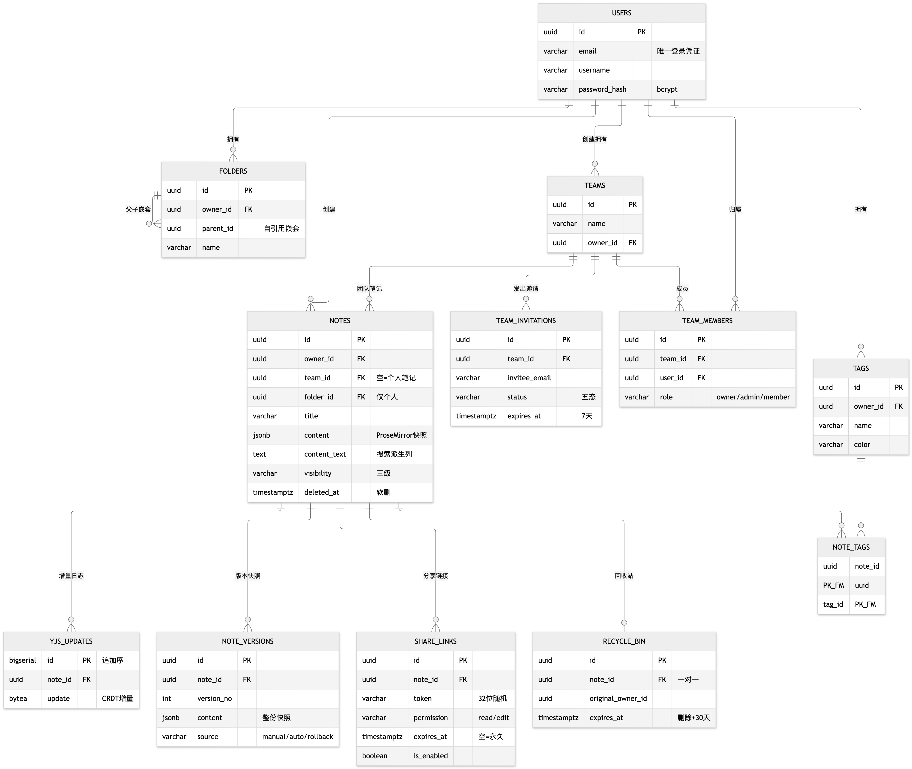

**图 4-3 系统E-R图**

### 4.3.2 用户表（users）

用户表存储账号信息：id（uuid 主键）、email 与 username（唯一，登录与展示）、password_hash（bcrypt 哈希，不落明文）、avatar_url 及创建/更新时间。

### 4.3.3 团队表（teams）

团队表记录名称、简介与创建者（owner_id 外键）。创建者同时在 team_members 中登记 owner 角色，一致性由服务层保证，属受控冗余（见 4.3.9）。

### 4.3.4 团队成员表（team_members）

承载用户与团队的多对多关系及角色属性：team_id 与 user_id 组合唯一，role 取值 owner/admin/member（CHECK 约束，RBAC 落点）。配套的团队邀请表（team_invitations）记录按邮箱发出的邀请、五态状态与 7 天有效期，仅接受的邀请转化为成员记录。

### 4.3.5 笔记表（notes）

笔记表是全库枢纽，如表 4-1 所示。team_id 为空为个人笔记、非空为团队笔记（CHECK 保证不挂个人文件夹）；content 以 JSONB 存储 ProseMirror 快照，content_text 为派生纯文本列供检索；deleted_at 为软删标记。支撑表包括 folders（自引用嵌套）、tags 与 note_tags（多对多）、yjs_updates（协作增量）。

**表 4-1 笔记表（notes）**

| 字段名 | 字段描述 | 数据类型 | 约束 |
|---|---|---|---|
| id | 笔记ID | uuid | 主键 |
| owner_id / team_id / folder_id | 创建者 / 团队 / 文件夹 | uuid | 外键；team 与 folder 互斥 |
| title | 标题 | varchar(200) | 非空 |
| content / content_text | 正文快照 / 纯文本派生列 | jsonb / text | 非空 |
| visibility | 可见性（private/team_read/team_edit） | varchar(20) | CHECK 约束 |
| deleted_at、created_at、updated_at | 软删时间、创建/更新时间 | timestamptz | 可空 / 非空 |

该表在真实数据库中的结构如图 4-4 所示。

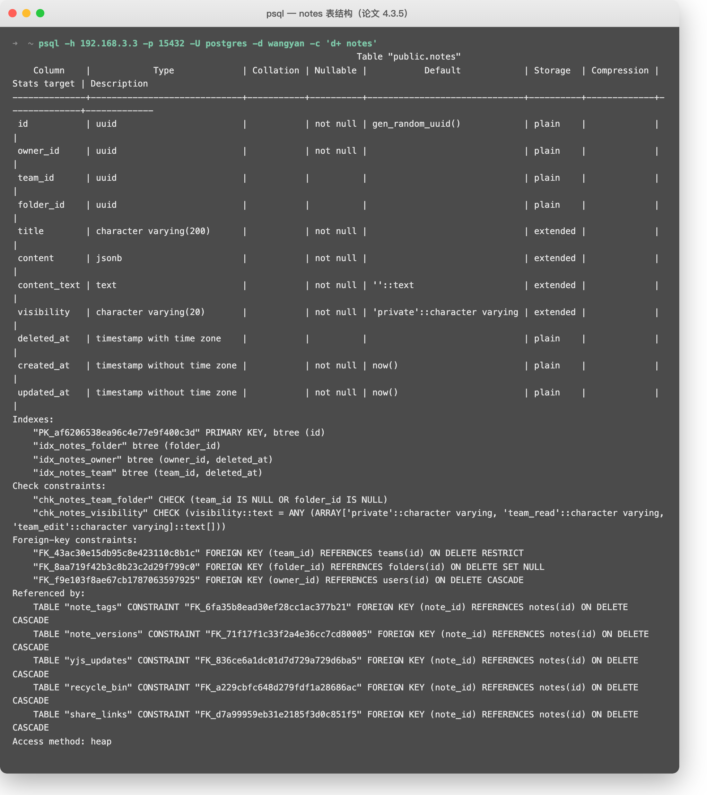

**图 4-4 notes 表真实结构（psql \\d+ notes）**

### 4.3.6 笔记版本表（note_versions）

版本表整份保存快照时刻的标题与正文（JSONB），version_no 笔记内递增；source 标记来源（manual / auto / rollback），构成“手动 + 关键事件”的快照策略。

### 4.3.7 分享链接表（share_links）

token 为链接中暴露的唯一凭证（安全随机数、32 位十六进制）；permission 取值 read/edit（默认 read）；expires_at 为空表示永久；is_enabled 支持即时停用；visit_count 记录访问次数。

### 4.3.8 回收站表（recycle_bin）

回收站表记录删除元数据：note_id（外键唯一）、original_owner_id 与 deleted_by（谁删的）、deleted_at 与 expires_at（何时到期，删除 + 30 天）。笔记本体不搬家——删除仅置 notes.deleted_at，保证以 note_id 为外键的关联不断裂；恢复即清软删标记并删本记录，彻底删除由外键级联清除。

### 4.3.9 数据库关系图

全库共 12 张基表，以 notes 为枢纽辐射展开，外键关系如图 4-5 所示；业务 CRUD 全部走基表。真实库建表清单如图 4-6 所示。

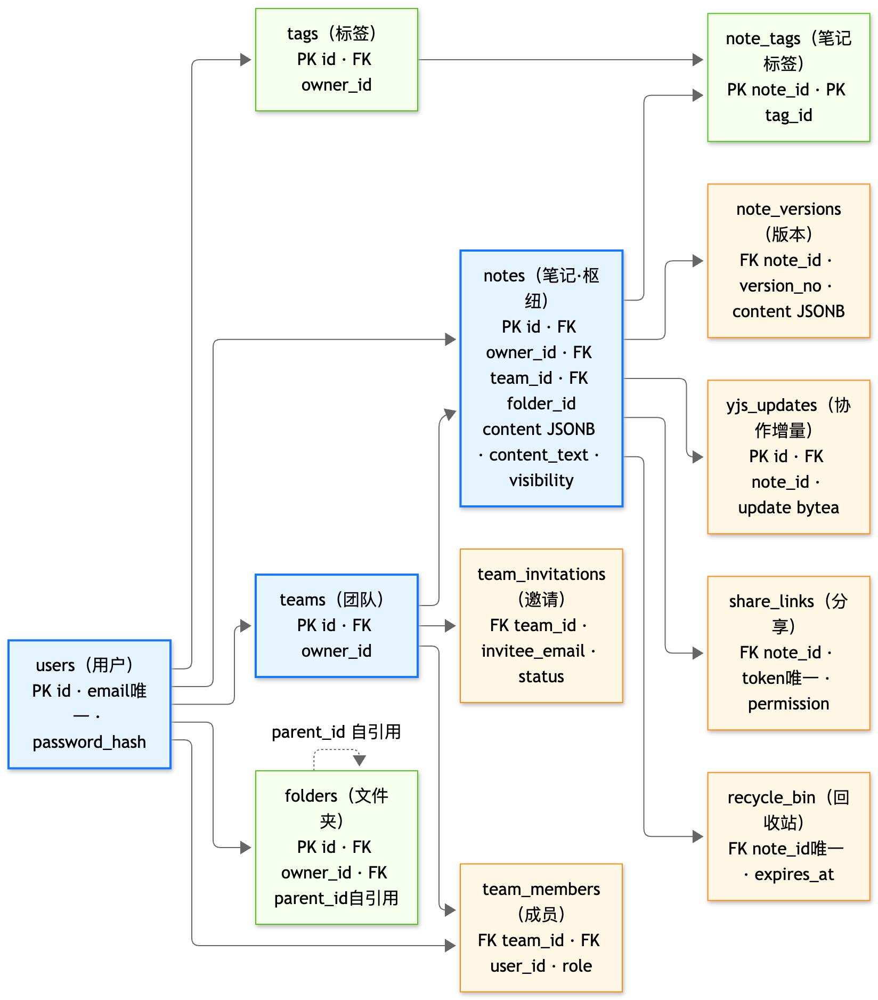

**图 4-5 数据库关系图（外键关系）**

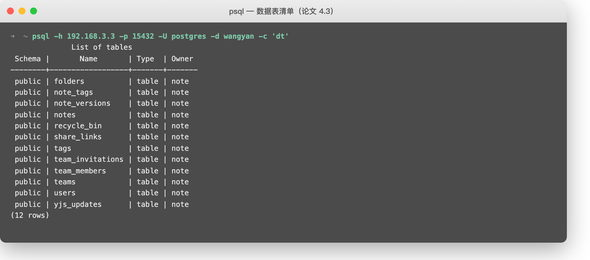

**图 4-6 真实库建表清单（psql \\dt）**

范式方面全库满足第三范式，另有四处受控反规范化并主动交代：content_text 派生列（搜索载体）、回收站删除时刻快照、版本整份快照（版本管理本质）、团队所有者双重表达（统一查询路径）。

## 4.4 实时协作设计

### 4.4.1 WebSocket连接管理

浏览器 WebSocket 无法自定义请求头，JWT 经查询参数传递，服务端在 upgrade 握手阶段校验令牌与笔记访问权限，失败返回 401。连接建立后由 y-websocket 负责保活、广播与断连清理，末个连接断开时执行会话收尾（见 4.4.2）；与 REST 共进程部署，经 Nginx 同一规则反代。

### 4.4.2 Yjs文档同步机制

文档同步采用“增量日志 + 快照”双轨设计，数据流如图 4-7 所示。打开文档时按自增序回放 yjs_updates 历史增量，无帧则从 notes.content 快照播种并存种子帧；协作中每帧增量缓冲 2 秒、以 Y.mergeUpdates 合并后追加入库；末连接断开时合并回写快照并压缩旧增量行；回写前执行防误清检查——会话文档为空而库中快照非空时跳过回写。增量广播走内存路径、与持久化完全异步，键入传播不受落盘耗时影响。增量帧的实际存储形态如图 4-8 所示。

【待插图 图 4-7 Yjs文档同步流程图。画图要点：泳道图（客户端 A / 客户端 B / 服务端）；打开文档→回放增量或播种→实时编辑→增量广播→2 秒缓冲合并入库→末连接断开→合并回写快照+压缩；标注“防误清检查”分支。】

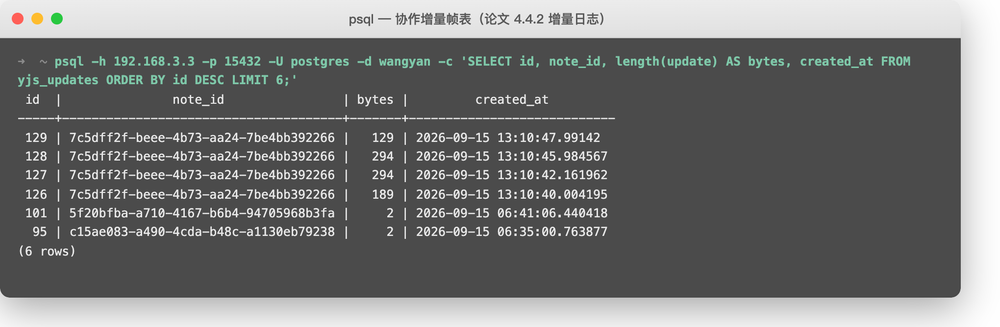

**图 4-8 协作增量帧表（yjs_updates）实拍**

### 4.4.3 光标同步与用户感知

基于 awareness 协议：客户端广播用户名、颜色与光标相对位置，服务端在参与者间转发；前端将远端光标渲染为带姓名标签的彩色光标并显示在线人数。

### 4.4.4 冲突解决策略

并发冲突由 Yjs 的 YATA 算法在数据结构层面解决：增量操作满足交换、结合与幂等性质，客户端无论以何种顺序收到对方的操作，最终文档必然收敛一致，无需中心锁或人工合并界面（第 6 章以双客户端实验验证）。

## 4.5 权限控制设计

### 4.5.1 RBAC权限模型设计

系统采用基于角色的访问控制模型，角色判定直接落在数据表上（见表 4-3）；权限校验集中在服务层角色断言函数中实现。

**表 4-3 角色判定条件**

| 角色 | 判定条件 |
|---|---|
| 个人用户 | 笔记 owner_id 为本人且 team_id 为空 |
| 团队管理员 | team_members.role 为 owner 或 admin |
| 团队成员 | role 为 member，叠加笔记 visibility 判定读写 |
| 访客 | share_links.token 有效，permission 决定读/写 |

### 4.5.2 笔记级权限控制

单篇笔记按“所有者 > 团队管理员 > 可编辑成员 > 只读成员”四级矩阵判定：team_edit 对普通成员可编辑，team_read 仅可读，private 仅所有者与管理员可见；不可见一律 404，防止存在性泄露。

### 4.5.3 团队级权限控制

团队维度约束管理行为：仅 owner 可调整角色与解散团队；owner/admin 可邀请、移除成员、撤回邀请；member 仅可退队。所有团队接口进入业务逻辑前先断言角色，权限不足返回 403。

### 4.5.4 分享链接权限控制

分享令牌即访客的临时凭证：read 链接只能读取快照；edit 链接可凭 token 经 WebSocket 握手进入实时协作。因 CRDT 广播模型下服务端无法约束客户端“只读”，对 read 链接的协作连接直接拒绝以防写穿。

## 4.6 系统接口设计

系统接口按资源分组并遵循统一约定，完整清单见附录 C。认证组四个接口；笔记组覆盖 CRUD、文件夹、标签、搜索、版本与回收站子资源；团队组覆盖团队 CRUD、成员管理、邀请流程与团队笔记；分享组分管理端与访客公开端。WebSocket 事件如表 4-4 所示。

**表 4-4 WebSocket 消息类型**

| type | 名称 | 方向 | 说明 |
|---|---|---|---|
| 0 | Sync | 双向 | 同步握手与实时增量广播，冲突收敛由 YATA 算法保证 |
| 1 | Awareness | 双向 | 用户感知状态（用户名、颜色、光标位置） |

# 第5章 系统实现

## 5.1 开发环境与工具

### 5.1.1 开发环境配置

开发环境为 Mac mini（Apple Silicon），工具链 Node.js 22 + pnpm 11；数据库与 Redis 以 Docker 容器运行于局域网 NAS。仓库采用 pnpm workspace 组织：apps/web、apps/server、packages/shared（共享类型），保证接口契约单一来源。

### 5.1.2 项目目录结构

后端 apps/server/src/modules/ 下一个目录对应论文一个模块，模块内按 controller/service/entity 分层；前端按登录注册、工作台、分享页、打印页组织，协作逻辑独立为 src/collaboration 层（见图 5-1）。

```
wangyan-2026/
├─ apps/
│  ├─ web/            # React 18 + Vite + Ant Design
│  │  └─ src/{pages, components, collaboration, auth, utils}
│  └─ server/         # NestJS
│     └─ src/modules/{auth, users, notes, teams, share,
│                     versions, recycle-bin, realtime, export}
├─ packages/shared/   # 共享类型
├─ docker-compose.yml
└─ docs/
```

**图 5-1 项目目录结构**

### 5.1.3 Docker开发环境搭建

数据层容器常驻 NAS：docker run 分别部署 PostgreSQL 16 与 Redis 7，数据目录统一挂载、备份迁移只需拷贝该目录；高位端口为避开 NAS 已占用的默认端口。容器重建即完全恢复，搭建与销毁成本极低。

## 5.2 用户认证模块实现

### 5.2.1 注册功能实现

注册请求经 class-validator 校验（邮箱格式、用户名长度、密码强度），服务层查唯一性（冲突 409），以 bcrypt 10 轮加盐哈希入库并返回脱敏用户，界面如图 5-2 所示。

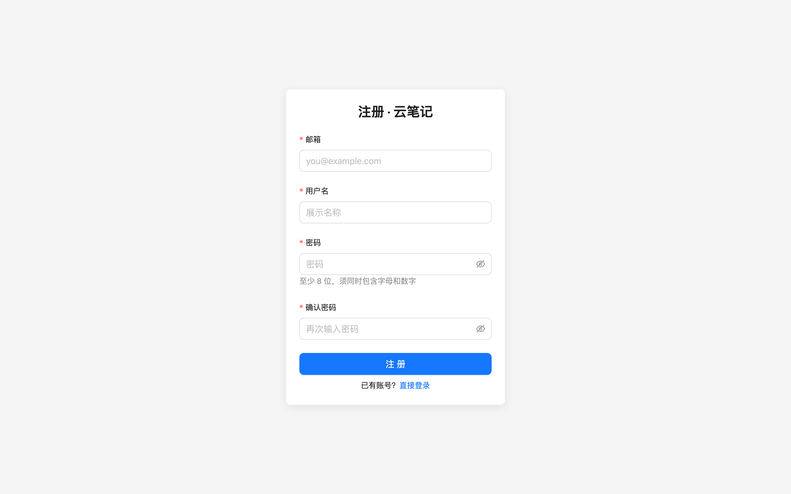

**图 5-2 用户注册界面**

### 5.2.2 登录与JWT Token生成

登录按邮箱查询用户并以 bcrypt 比对哈希，失败统一提示“邮箱或密码错误”防枚举；通过后签发 HS256 JWT（载荷含 sub、username、jti 与过期时间），界面如图 5-3 所示。


**图 5-3 用户登录界面**

### 5.2.3 路由守卫与身份校验

后端全局注册 JwtAuthGuard：解析 Bearer 令牌并先查 Redis 黑名单（auth:denylist:{jti}），命中即拒绝。前端以 React Context 维护登录态，401 统一跳转登录页。

### 5.2.4 界面展示与核心代码

登录后进入工作台，如图 5-4 所示。核心代码：auth.service.ts、jwt.strategy.ts、AuthContext.tsx。

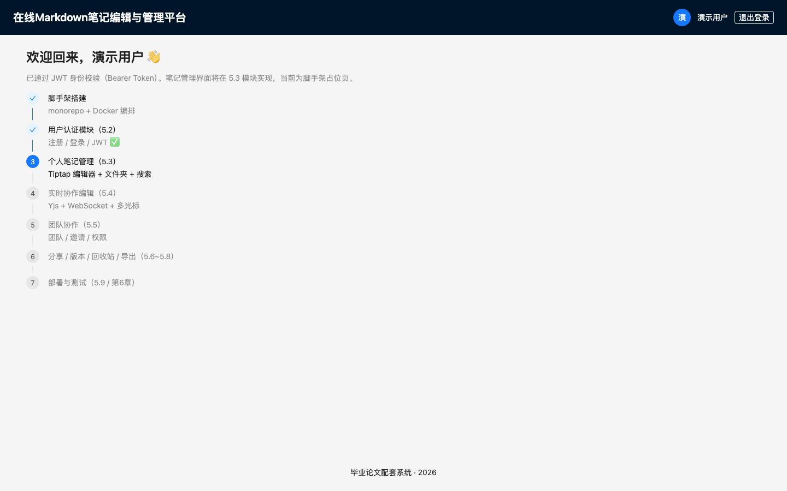

**图 5-4 登录后工作台首页**

## 5.3 个人笔记管理模块实现

### 5.3.1 笔记的创建与编辑

编辑采用 Tiptap，文档模型为 ProseMirror JSON，与 JSONB 存储一致、无需转换。前端以 800 毫秒防抖自动保存，状态栏四态反馈；空标题服务端兜底。删除为软删除并写回收站元数据（30 天到期）；越权访问一律 404。编辑界面如图 5-5 所示，正文滚动时顶部标题栏与工具栏保持冻结。

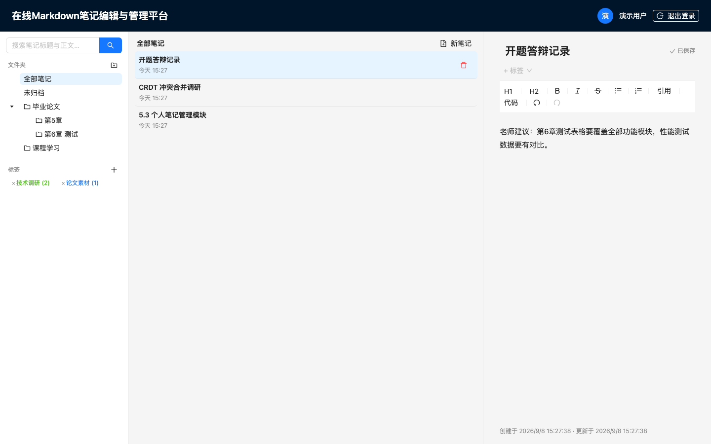

**图 5-5 笔记编辑界面（长文滚动时顶部工具栏冻结）**

### 5.3.2 Markdown实时预览

预览采用 input rules 实现“所写即所见”：输入 `# `、`- ` 等前缀即时转换为节点，无需双栏布局——也为实时协作奠定基础（协作只在单一文档模型上成立）。初版覆盖核心语法，后迭代补充图片、表格、链接、任务列表并引入 GitHub 风格主题，效果如图 5-6 所示。

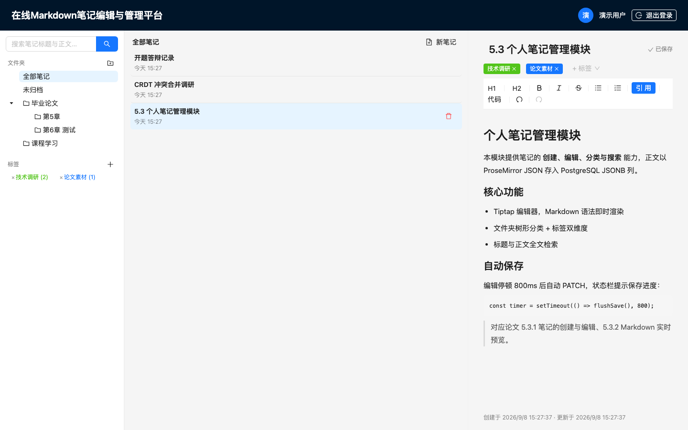

**图 5-6 Markdown 语法即时渲染**

### 5.3.3 笔记分类与文件夹管理

文件夹以 parent_id 自引用支持多级嵌套，服务层做同级查重与防环校验，仅允许删除空文件夹；标签自定义颜色，经关联表与笔记多对多。界面如图 5-7 所示。

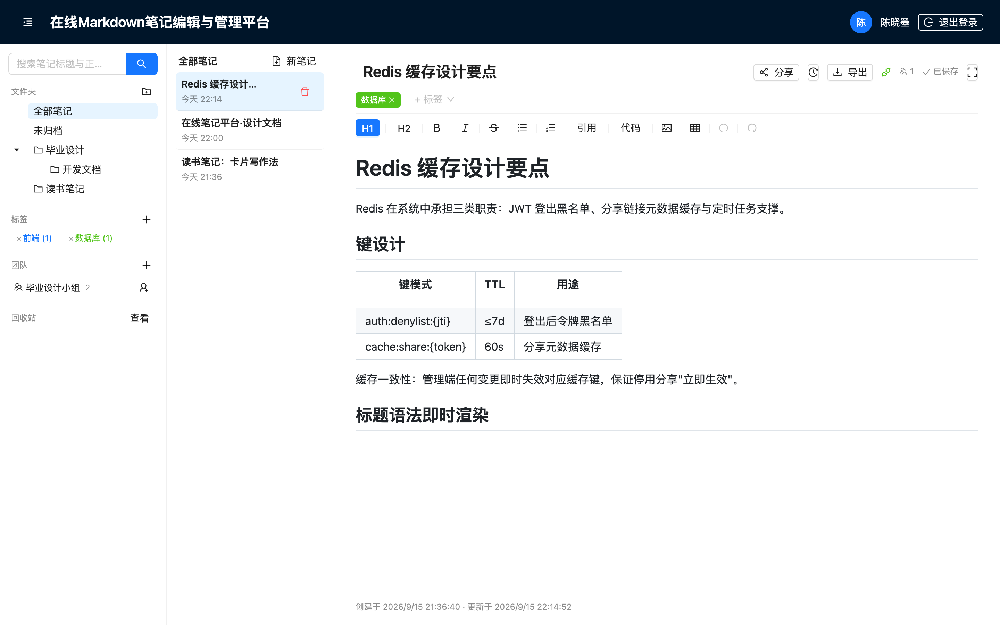

**图 5-7 文件夹与标签管理**

### 5.3.4 笔记搜索功能

搜索覆盖标题与正文：正文基于 content_text 以 ILIKE 子串匹配并转义通配符。选 ILIKE 而非 tsvector 是因为内置分词器不切分中文、全文索引对中文子串基本无效，当前规模下子串匹配足够。支持 URL 深链，如图 5-8 所示。

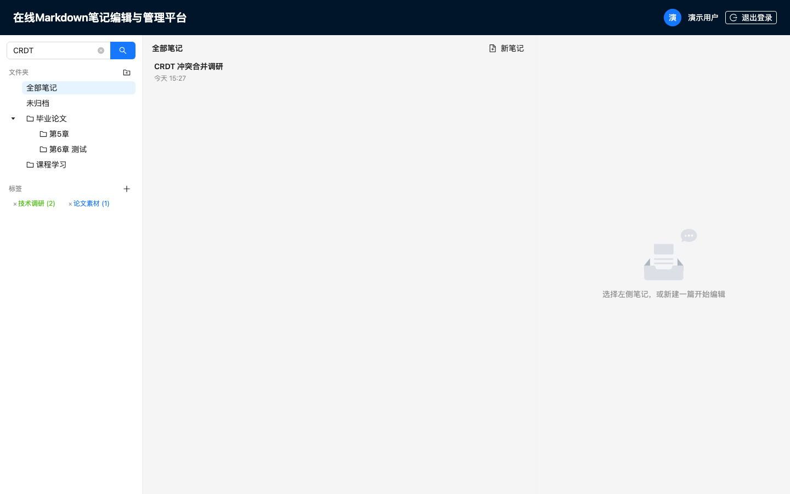

**图 5-8 笔记搜索**

### 5.3.5 界面展示与核心代码

工作台为三栏布局，编辑区宽度自适应；专注模式下两侧栏与顶栏隐藏、编辑器独占整页（Esc 退出），如图 5-9 所示。核心代码：notes.service.ts、NoteEditorPanel.tsx、HomePage.tsx。

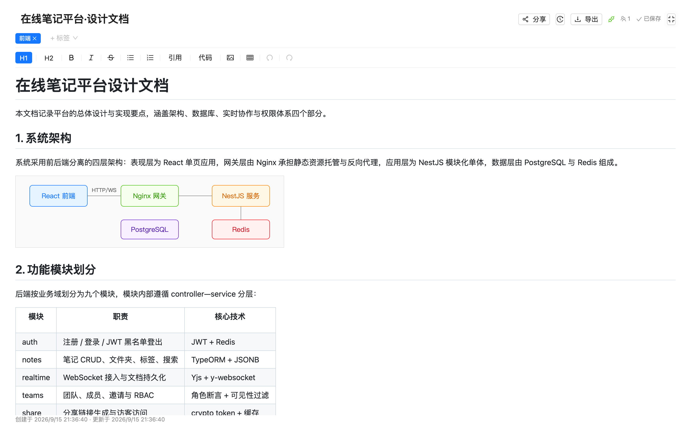

**图 5-9 专注模式（编辑器独占整页）**

## 5.4 实时协作编辑模块实现

### 5.4.1 WebSocket服务端实现

服务端复用 y-websocket 的 setupWSConnection，挂载在 NestJS HTTP server 的 upgrade 事件上，与 REST 共进程（路径 /ws/:noteId），握手期校验 JWT 与笔记访问权限。持久化实现 IDatabasePersistence 接口：bindState 负责回放/播种，writeState 负责合并回写，服务端日志如图 5-10 所示。实现中修复了播种竞态——“连接即断→再连接”会让同一快照播种两次，修复为按笔记加互斥锁串行化。

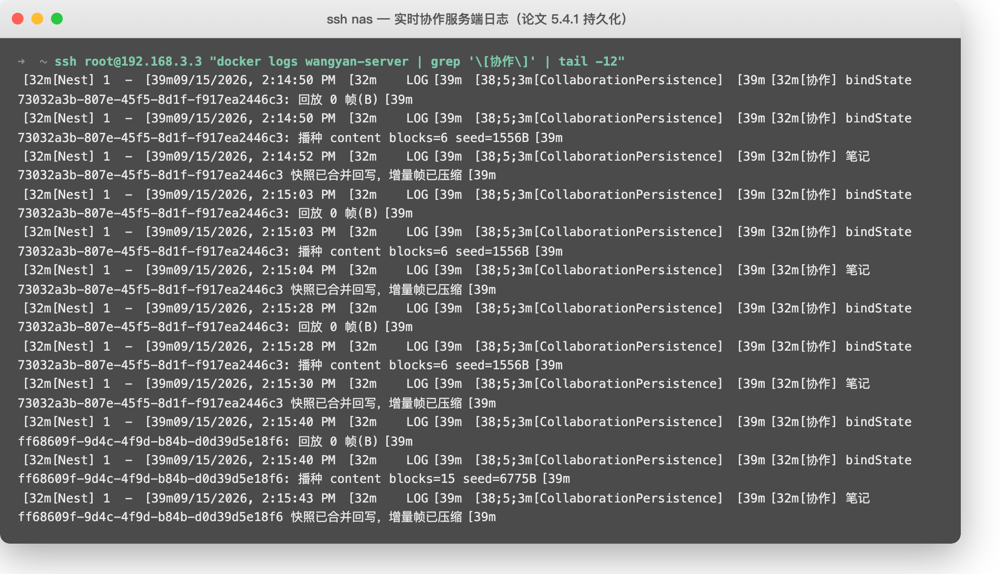

**图 5-10 协作持久化服务端日志（播种/回放/合并回写）**

### 5.4.2 Yjs前端集成

前端将 Tiptap 的 Collaboration 扩展与 WebsocketProvider 绑定：按键经 y-prosemirror 转为增量双向同步，界面如图 5-11 所示。会话生命周期由 useEffect 严格管理——开发期曾因 useMemo 双调用泄漏连接产生“幽灵在线用户”，据此加固；另有防误清保护：同步未完成即断开的空会话不覆盖非空快照。

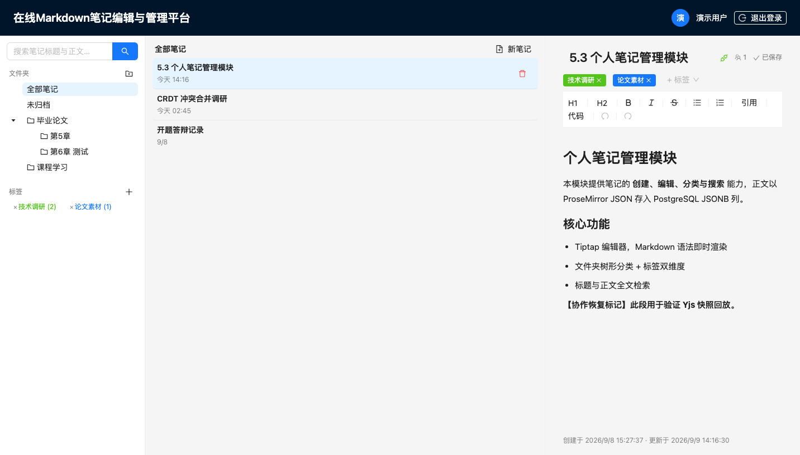

**图 5-11 Yjs 驱动的协作编辑器（连接状态与在线人数）**

### 5.4.3 多用户光标同步

光标由 CollaborationCursor 扩展与 awareness 协议同步：客户端广播用户名、颜色与光标位置，他端渲染为带姓名标签的彩色光标并显示在线人数（图 5-12）。

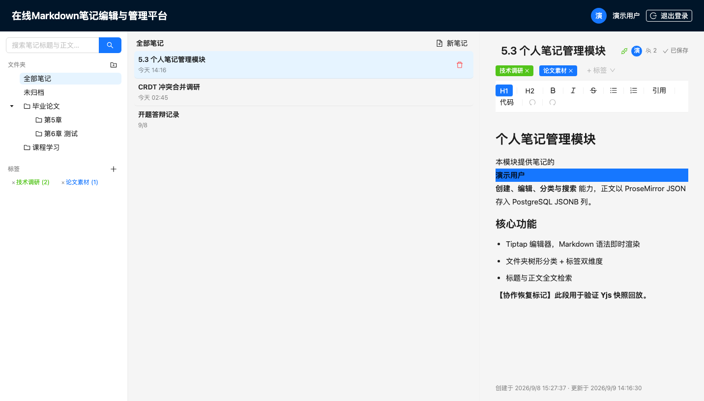

**图 5-12 双用户多光标同步效果（乙端视角）**

### 5.4.4 冲突合并与一致性保证

以双客户端并发编辑实验验证 CRDT 收敛：A 在文首、B 在文末并发插入，互不知晓；同步后断言两端文档逐字节一致，如图 5-13 所示。

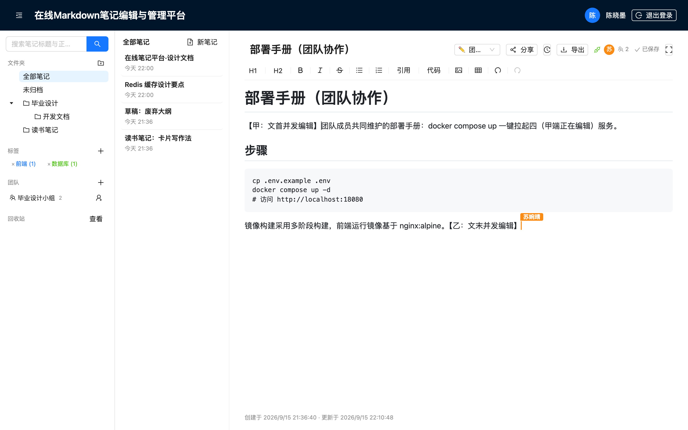

**图 5-13 并发编辑合并结果（甲端视角，文首/文末编辑并存）**

### 5.4.5 界面展示与核心代码

核心代码：collaboration.persistence.ts（回放/播种/回写/压缩/防误清）、realtime.service.ts、yjs-convert.ts（无 Schema 播种转换）、NoteEditorPanel.tsx。

## 5.5 团队协作模块实现

### 5.5.1 团队的创建与管理

创建团队时创建者自动写入 team_members（owner）与 teams.owner_id 双写一致；解散前团队内仍有笔记则拒绝。成员管理支持角色调整（仅 owner）、移除成员与退队，界面如图 5-14 所示。

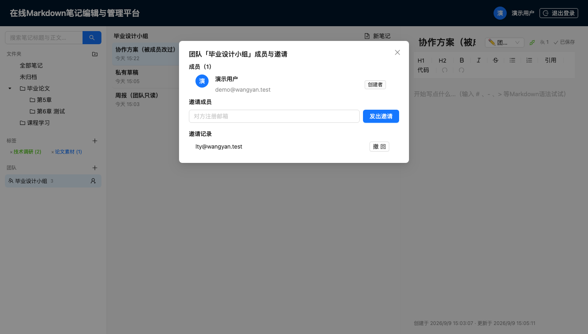

**图 5-14 团队管理界面（成员与角色）**

### 5.5.2 团队成员邀请与审批

邀请按邮箱发起（7 天有效），被邀请人接受或拒绝，邀请人可撤回，过期自动置 expired；同一团队对同一邮箱仅一条有效邀请。邀请记录如图 5-15 所示。

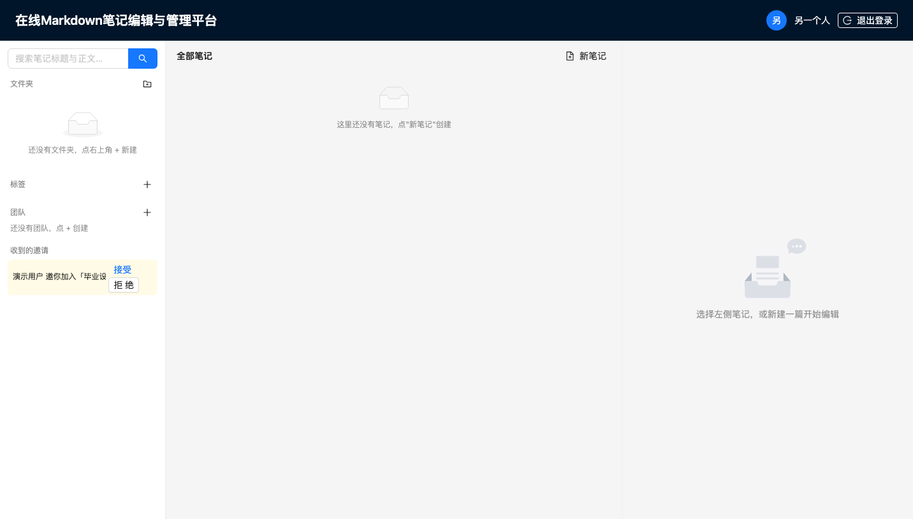

**图 5-15 邀请记录（含待处理邀请）**

### 5.5.3 团队笔记权限分配

团队笔记按四级访问矩阵判定（owner / team_admin / team_edit / team_read），集中在 getAccessLevel 与角色断言函数中；成员列表按角色过滤。WebSocket 连接权限与编辑权限对齐：只读成员连接被 401 拒绝，从传输层防止写穿。可见性设置如图 5-16 所示。

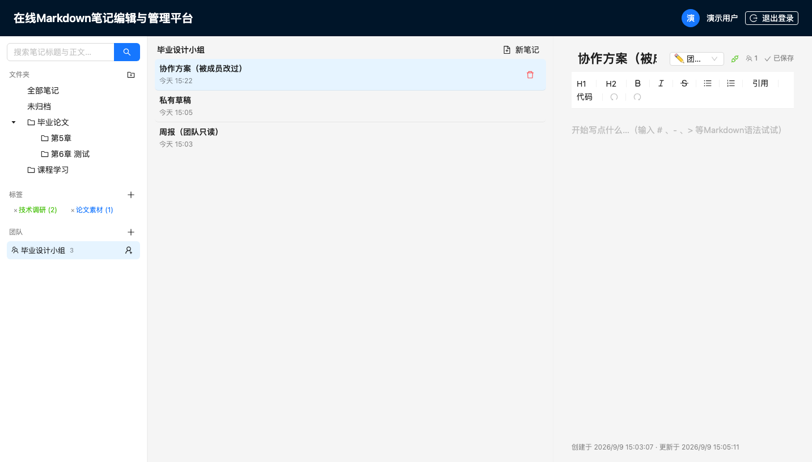

**图 5-16 团队笔记可见性设置（下拉展开）**

### 5.5.4 界面展示与核心代码

核心代码：teams.service.ts（RBAC 集中实现、邀请生命周期、可见性过滤）、realtime.service.ts（WS 权限对齐）、TeamManageModal.tsx。只读成员视角如图 5-17 所示。

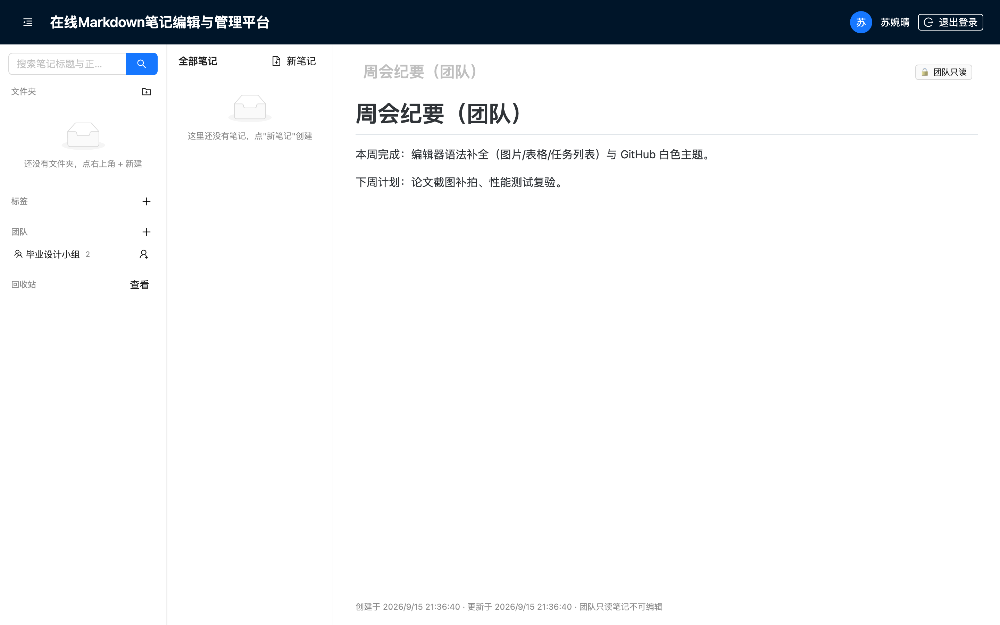

**图 5-17 只读成员视角（团队只读）**

## 5.6 笔记分享模块实现

### 5.6.1 分享链接生成

分享弹窗支持选择权限（只读/可编辑）与有效期，如图 5-18 所示。服务端以 crypto 的 randomBytes 生成 32 位十六进制 token 写入 share_links；创建与变更仅限笔记所有者或团队 owner/admin。

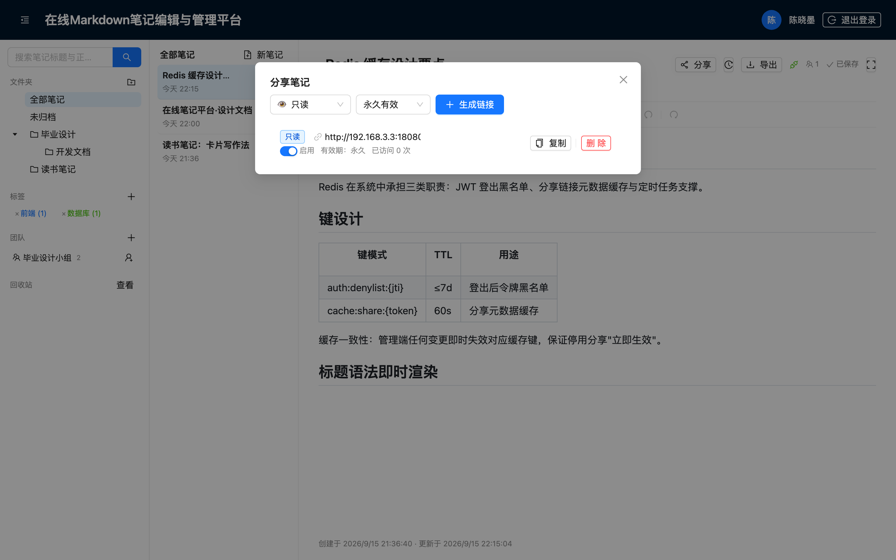

**图 5-18 分享链接生成与管理界面**

### 5.6.2 链接访问权限控制

访客公开页 /s/:token 免登录：经公开解析接口取元数据（停用/过期/已删/伪造统一 404 防枚举），再拉取正文渲染；结果经 Redis 缓存 60 秒、变更即时失效。可编辑链接的访客凭 token 经 WebSocket 握手进入同一 Yjs 文档实时协作（JWT 校验失败时回落到分享 token 校验），如图 5-19 所示。

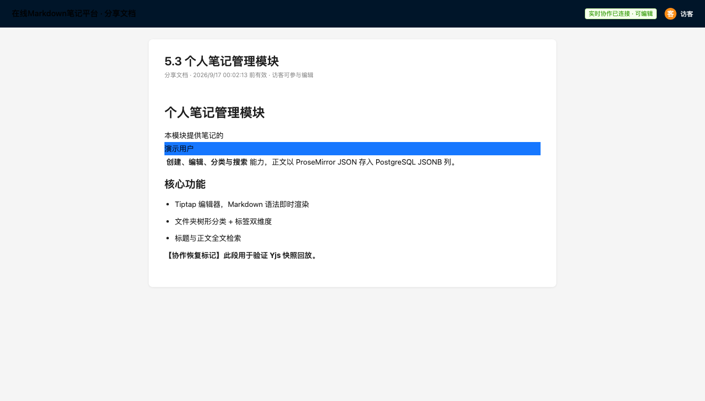

**图 5-19 访客实时协作（在线人数含访客）**

### 5.6.3 分享链接有效期管理

expires_at 为空表示永久、否则到期失效；is_enabled 支持随时停用与恢复，变更即时失效 Redis 缓存，保证停用立即生效。

### 5.6.4 界面展示与核心代码

核心代码：share.service.ts（token 解析、缓存、防枚举 404）、realtime.service.ts（访客 share-token 鉴权）、SharePage.tsx、ShareModal.tsx。

## 5.7 版本管理与回收站实现

### 5.7.1 版本历史记录

快照实现“手动 + 关键事件”策略：手动保存；会话结束且有变更时自动建版（auto）；回滚前自动留档（rollback）。自动建版以纯文本变化为触发条件，并与最新版本做“标题+内容”双比较去重（首测只比内容致纯改标题场景丢失快照，已修复）。版本抽屉如图 5-20 所示，预览面板完整渲染含图片与表格的快照。

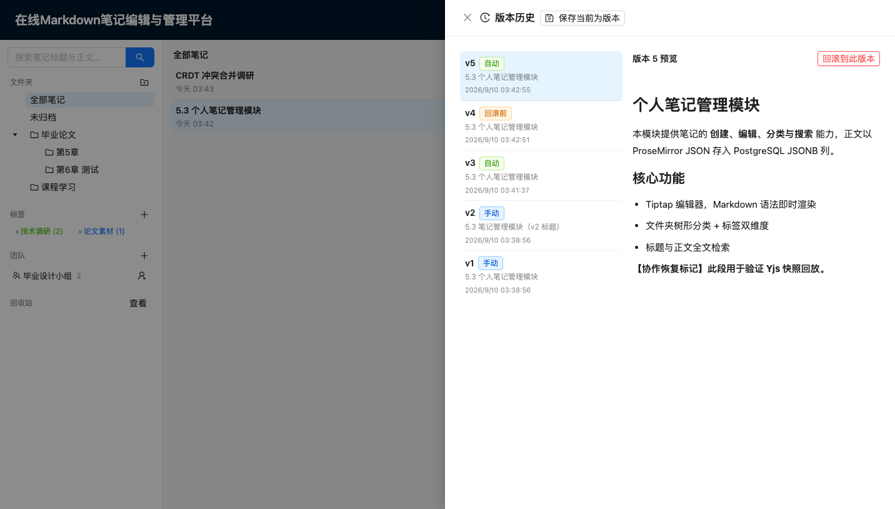

**图 5-20 版本历史抽屉（含快照预览）**

### 5.7.2 版本回滚与恢复

回滚实现冷热双路径：热文档（有协作会话）以 CRDT 操作落地——清空文档片段、按快照重建并原子提交，在线端实时可见且增量自然入库；冷文档直接回写快照并作废旧增量帧。若直接改快照字段，回滚会被协作增量覆盖且在线端不可见，双路径正是为规避该问题。

### 5.7.3 回收站与软删除

回收站列表展示标题、删除时间与剩余天数，如图 5-21 所示。恢复清除软删标记并放回原文件夹；彻底删除由外键级联清除关联数据。

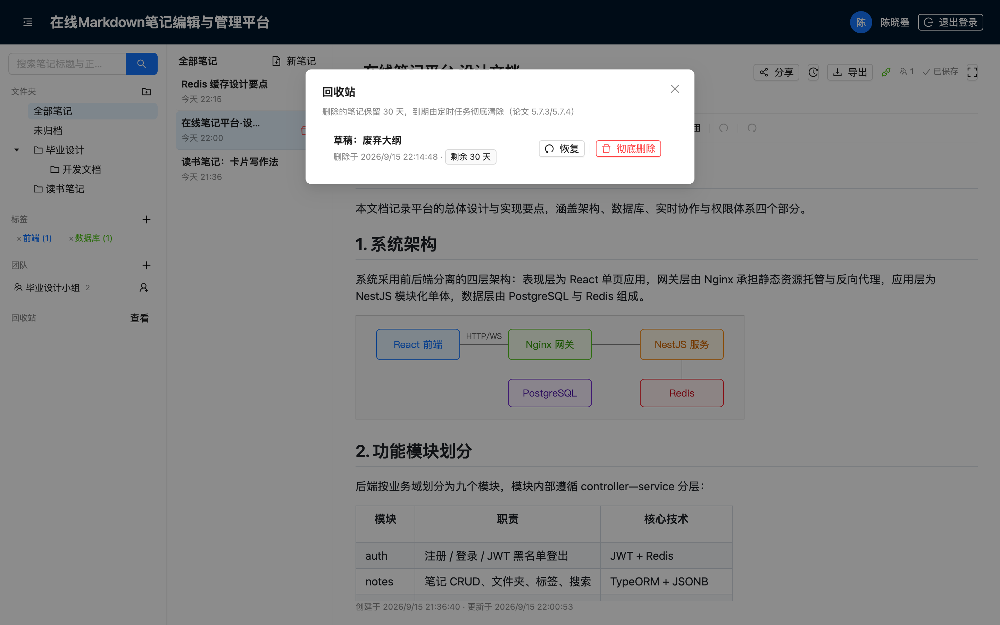

**图 5-21 回收站界面（剩余保留天数与恢复/彻底删除）**

### 5.7.4 定时清理机制

定时任务基于 @nestjs/schedule，每小时与启动时扫描：回收站到期彻底清除，过期邀请置 expired。清理依据 recycle_bin.expires_at（建有索引）。

### 5.7.5 界面展示与核心代码

核心代码：versions.service.ts（三态快照与回滚双路径）、collaboration.persistence.ts（自动建版）、cleanup.service.ts、VersionDrawer.tsx。

## 5.8 笔记导出功能实现

### 5.8.1 导出为PDF

PDF 导出为纯前端方案：独立打印视图 /print/:noteId 以适合纸面的排版渲染正文，加载后自动调起打印对话框，“另存为 PDF”即得成品。相比服务端无头浏览器，不引入重型依赖、镜像轻量。产物样例见 docs/assets/5.8.1-export.pdf。

### 5.8.2 导出为Markdown

Markdown 导出基于 tiptap-markdown：与编辑器共用同一套文档 Schema，保证导出与所见严格一致。产物经浏览器 Blob 下载，样例见 docs/assets/5.8.2-export.md。

### 5.8.3 界面展示与核心代码

导出入口位于编辑器工具栏“导出”菜单，如图 5-22 所示。核心代码：utils/export.ts、PrintPage.tsx。

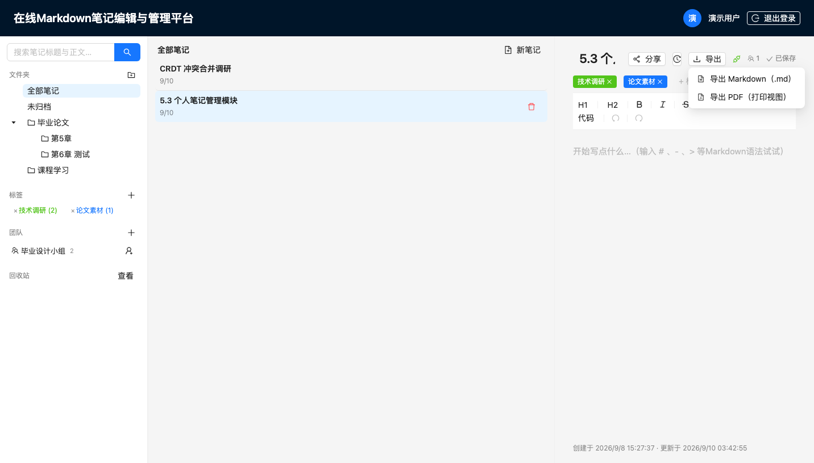

**图 5-22 导出菜单（Markdown / PDF）**

## 5.9 系统部署实现

### 5.9.1 Docker镜像构建

前后端各用多阶段构建 Dockerfile：运行阶段分别基于 node:22-alpine（约 330MB）与 nginx:alpine（约 71MB）仅携带产物。前端按依赖库分包（manualChunks），过程中发现裸子串匹配会把依赖内部文件误归入 react 块形成循环引用导致部署页崩溃，改用带路径分隔符的精确匹配解决——该问题在 NAS 真机部署时暴露。

### 5.9.2 Docker Compose服务编排

Compose 编排 postgres、redis、server、web 四服务，配置依赖顺序、健康检查与重启策略，`docker compose up -d` 一键拉起（见附录 B）。Nginx 托管前端并反代 /api 与 /ws；配置以“模板 + 环境变量注入”支持两种部署形态：Compose 注入服务名，单机部署注入宿主机地址。

### 5.9.3 部署脚本与一键启动

生产部署在 NAS 设备上。因 NAS 的 Docker 不含 Compose 插件，生产采用 docker run：脚本依次拉起数据库与两个应用容器，环境经 --env-file 注入；Compose 方案作为标准一键启动方案保留在仓库，两套方式应用配置一致。部署后对全流程端到端复验（DEP-04~10、DEP-R1~8），容器运行状态如图 5-23 所示，部署后登录页如图 5-24 所示。

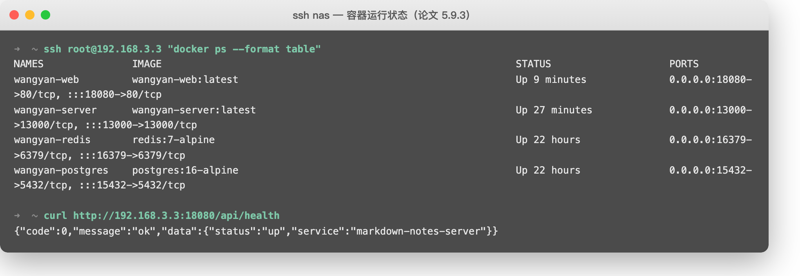

**图 5-23 NAS 容器运行状态（四容器）**

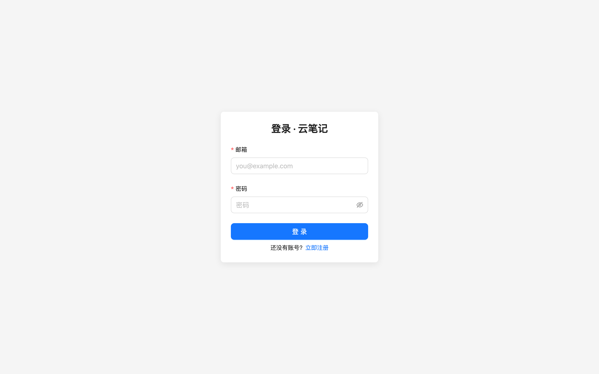

**图 5-24 NAS 部署后的登录页**

# 第6章 系统测试

## 6.1 测试环境与工具

测试均在真实部署系统上执行：服务端为 NAS 上的四个 Docker 容器，客户端为同局域网 Mac mini。功能测试用 curl 做接口边界用例、Edge 无头浏览器做双端协作；性能测试用 Node 脚本模拟并发与编辑。功能用例共 121 条，全部在真实系统上执行。

## 6.2 功能测试

### 6.2.1 用户认证功能测试

共 10 条，覆盖注册校验、重复拦截、防枚举、守卫拦截与登出黑名单，摘选如表 6-1 所示。

**表 6-1 用户认证功能测试用例（摘选）**

| 编号 | 用例 | 操作步骤 | 预期结果 | 实际结果 | 结论 |
|---|---|---|---|---|---|
| AUTH-04 | 重复邮箱 | 同邮箱再次注册 | 409 | 409，提示一致 | 通过 |
| AUTH-10 | 登出后令牌失效 | 登出后用原令牌访问 | 再访问 401 | 401，Redis 出现黑名单键 | 通过 |

### 6.2.2 笔记管理功能测试

共 26 条，覆盖创建、编辑、自动保存、软删回收站、越权 404、分类与搜索防护，摘选如表 6-2 所示。

**表 6-2 笔记管理功能测试用例（摘选）**

| 编号 | 用例 | 操作步骤 | 预期结果 | 实际结果 | 结论 |
|---|---|---|---|---|---|
| NOTE-05 | 自动保存 | 编辑正文停止输入约 1 秒 | 自动保存，状态栏“已保存” | 一致 | 通过 |
| NOTE-12 | 越权访问 | 用 A 账号访问 B 的笔记 | 404（不暴露存在性） | 404 | 通过 |

### 6.2.3 实时协作功能测试

共 14 条，覆盖连接鉴权、文档回放/播种、会话收尾回写、防误清保护、并发合并与多光标同步，摘选如表 6-3 所示。

**表 6-3 实时协作功能测试用例（摘选）**

| 编号 | 用例 | 操作步骤 | 预期结果 | 实际结果 | 结论 |
|---|---|---|---|---|---|
| COLLAB-02 | 伪造令牌拒绝 | 携带伪造 token 连接 WS | HTTP 401 拒绝 | 401 | 通过 |
| COLLAB-11 | 并发合并收敛 | A 文首、B 文末并发插入 | 双方最终文档一致 | 逐字节一致 | 通过 |

### 6.2.4 团队管理功能测试

共 23 条，覆盖团队 CRUD、成员角色、邀请全生命周期、可见性矩阵与 WS 权限对齐，摘选如表 6-4 所示。

**表 6-4 团队管理功能测试用例（摘选）**

| 编号 | 用例 | 操作步骤 | 预期结果 | 实际结果 | 结论 |
|---|---|---|---|---|---|
| TEAM-09 | 接受邀请 | 被邀请人接受 | 成为成员，状态 accepted | 一致 | 通过 |
| TEAM-20 | 只读成员连接拒绝 | team_read 成员连接协作 WS | 401（防写穿） | 401 | 通过 |

### 6.2.5 分享功能测试

共 17 条，覆盖链接生成、公开访问、失效矩阵、访客协作与缓存一致性，摘选如表 6-5 所示。

**表 6-5 分享功能测试用例（摘选）**

| 编号 | 用例 | 操作步骤 | 预期结果 | 实际结果 | 结论 |
|---|---|---|---|---|---|
| SHARE-08 | 停用即时生效 | 停用后立即访问 | 404 | 404（缓存已失效） | 通过 |
| SHARE-14 | 访客可编辑协作 | 凭 edit 链接进入协作 | 与登录用户实时同步 | 一致 | 通过 |

### 6.2.6 版本管理功能测试

共 15 条，覆盖三类快照来源、热/冷回滚双路径、回滚前留档、恢复与级联删除、定时清理，摘选如表 6-6 所示。

**表 6-6 版本管理功能测试用例（摘选）**

| 编号 | 用例 | 操作步骤 | 预期结果 | 实际结果 | 结论 |
|---|---|---|---|---|---|
| VER-05 | 回滚前留档 | 纯改标题后回滚 | 当前状态先存 rollback 版本 | 一致（首轮缺陷已修复） | 通过 |
| CLN-01 | 到期自动清理 | 构造到期数据触发扫描 | 彻底删除，级联清除 | 一致 | 通过 |

### 6.2.7 测试结果汇总

八个模块共执行 121 条功能用例，全部通过，如表 6-7 所示。测试过程共发现 6 个缺陷并全部修复，包括空会话误覆盖快照、播种竞态、回滚留档遗漏、前端分包循环引用致部署页崩溃等，修复后均补充回归用例。

**表 6-7 功能测试结果汇总**

| 模块 | 用例数 | 通过 | 通过率 |
|---|---|---|---|
| 用户认证 / 笔记管理 | 10 / 26 | 36 | 100% |
| 实时协作编辑 / 团队协作 | 14 / 23 | 37 | 100% |
| 笔记分享 / 版本与回收站 | 17 / 15 | 32 | 100% |
| 笔记导出与部署（佐证） | 16 | 16 | 100% |
| **合计** | **121** | **121** | **100%** |

## 6.3 性能测试

### 6.3.1 接口响应时间测试

对代表性接口经 Nginx 反代、局域网采样（登录 20 次、其余各 50 次），结果如表 6-8 所示，脚本实测运行如图 6-1 所示。

**表 6-8 接口响应时间测试结果**

| 接口 | 采样数 | 平均 (ms) | p95 (ms) | 最大 (ms) |
|---|---|---|---|---|
| POST /auth/login（含 bcrypt） | 20 | 72.8 | 77.5 | 77.5 |
| GET /notes（列表） | 50 | 5.3 | 7.2 | 8.8 |
| GET /notes/:id（详情含 JSONB 正文） | 50 | 5.6 | 8.2 | 8.5 |
| GET /notes?keyword=（全文搜索） | 50 | 5.3 | 7.7 | 9.4 |
| 写入（创建 + 软删两次往返） | 50 | 23.8 | 28.5 | 43.8 |

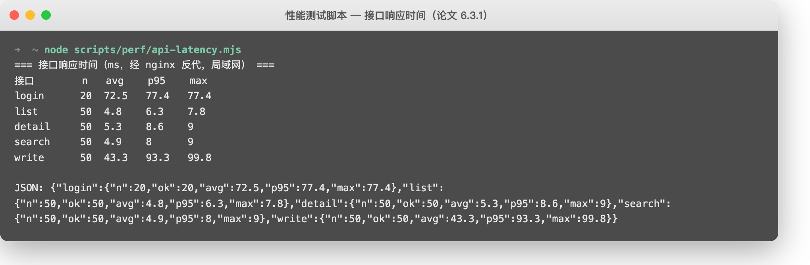

**图 6-1 接口性能测试脚本实测运行**

### 6.3.2 WebSocket并发连接测试

以 200 个客户端分批连入 2 篇笔记模拟多人协作：建连成功率 200/200，建连耗时平均 10.0ms、p95 13.4ms、最大 29.1ms。

### 6.3.3 实时编辑延迟测试

以双客户端测量“一端提交→服务端广播→另一端收到”的单向传播延迟，采样 30 次：平均 0.8ms、p95 1.7ms、最大 3.1ms。

### 6.3.4 测试结果分析

（1）读接口平均响应约 5.3ms、p95 低于 8.5ms，链路开销可控；（2）写接口约为读的 4 倍，远低于 100ms 交互阈值；登录 72.8ms 主要来自 bcrypt 的刻意计算成本，属安全设计的预期代价；（3）实时编辑传播延迟平均 0.8ms、显著快于 REST，验证了“广播走内存、持久化异步化”的架构收益；（4）200 路并发全部成功，对演示规模余量充足。全部脚本可复现。

## 6.4 兼容性测试

### 6.4.1 浏览器兼容性

系统全部功能与截图基于 Microsoft Edge（Chromium 152）完成全流程验证；Chrome 同内核预期一致；Safari 与 Firefox 列为人工复核项，如表 6-9 所示。

**表 6-9 浏览器兼容性测试结果**

| 浏览器 | 内核 | 登录 | 编辑/协作 | 分享页 | 导出 | 结果 |
|---|---|---|---|---|---|---|
| Microsoft Edge 152 | Chromium | 通过 | 通过（含多光标） | 通过 | 通过 | 全流程通过 |
| Chrome | Chromium | 预期一致 | 预期一致 | 预期一致 | 预期一致 | 待人工复核 |
| Safari / Firefox | — | — | — | — | — | 待人工复核 |

### 6.4.2 移动端适配

工作台为桌面多栏布局，未做移动端响应式折叠，列入第 7 章改进方向。

# 第7章 总结与展望

## 7.1 工作总结

本文完成了在线 Markdown 笔记编辑与管理平台的设计与实现：（1）完成需求分析，划分四类用户角色与七个功能模块；（2）完成系统设计，包括四层架构、12 张表的数据模型、“增量日志 + 快照”双轨的实时协作机制与四级权限矩阵；（3）完成全部模块实现与 Markdown/PDF 导出、容器化部署；（4）以 121 条功能用例（100% 通过）与三类性能测试验证：接口平均响应 5.3ms、编辑传播延迟 0.8ms、200 路并发全部成功。系统已部署于 NAS 并完成端到端验证，达到可现场演示状态。

## 7.2 系统创新点

### 7.2.1 基于CRDT的实时协作机制

系统以 Yjs（CRDT）为内核实现实时协作，并在工程层面做了完整的持久化闭环：增量回放与快照播种、缓冲合并入库、会话结束的合并回写与压缩、防误清保护，以及“广播走内存、持久化异步化”的分层，使亚毫秒级编辑传播与可靠持久化兼得。访客可编辑链接复用同一条链路，将协作能力延伸到匿名访客。

### 7.2.2 细粒度的多级权限管控

系统构建了“角色—资源—链接”三层叠加的权限体系：团队三级角色、笔记四级访问矩阵、访客链接权限，并将 REST 与 WebSocket 的权限判定对齐，堵住“只读成员经协作通道写穿数据”的旁路；判定失败对不可见资源统一返回 404，不泄露存在性。

### 7.2.3 容器化的一键部署方案

以 Docker 多阶段构建将前后端镜像压缩至约 330MB 与 71MB，Compose 编排实现一键启动与健康检查自愈；Nginx 以“模板 + 环境变量注入”支持两种部署形态。系统在 NAS 上完成两轮完整真机部署验证（含一次设备重装后的重部署）。

## 7.3 存在的不足与改进方向

### 7.3.1 离线编辑支持

当前协作依赖实时连接，断网期间无法编辑。Yjs 生态支持将增量保存在 IndexedDB、联网后自动补传，数据层的追加式增量日志预留了补传路径，后续可引入 y-indexeddb 实现离线优先编辑。此外，正文检索基于子串匹配，中文分词检索（zhparser）可作为改进项。

### 7.3.2 移动端原生应用

工作台为桌面多栏布局，未适配移动端。改进方向：对 Web 应用做响应式改造，小屏折叠为单栏浏览 + 全屏编辑；或基于 React Native/Flutter 开发移动端，复用现有接口。

### 7.3.3 AI辅助写作集成

笔记平台与 AI 写作结合是当前趋势。系统正文以结构化 JSON 存储、接口层完备，为接入大模型能力（摘要、润色、续写、知识问答）提供了良好基础，可作为后续演进方向。

# 参考文献

[1] Shapiro M, Preguiça N, Baquero C, et al. Conflict-free replicated data types[C]//Proceedings of the 13th International Symposium on Stabilization, Safety, and Security of Distributed Systems (SSS). Berlin: Springer, 2011: 386-400.

[2] Ellis C A, Gibbs S J. Concurrency control in groupware systems[C]//Proceedings of the ACM SIGMOD International Conference on Management of Data. New York: ACM, 1989: 399-407.

[3] Sun C, Ellis C. Operational transformation in real-time group editors: issues, algorithms, and achievements[C]//Proceedings of the ACM Conference on Computer Supported Cooperative Work (CSCW). New York: ACM, 1998: 59-68.

[4] Fielding R T. Architectural styles and the design of network-based software architectures[D]. Irvine: University of California, Irvine, 2000.

[5] Jones M, Bradley J, Sakimura N. JSON Web Token (JWT): RFC 7519[S]. [S.l.]: IETF, 2015.

[6] Haverbeke M. ProseMirror: a toolkit for building rich-text editors[EB/OL]. [2026-09-10]. https://prosemirror.net.

[7] Yjs. Yjs documentation: a CRDT implementation for collaborative applications[EB/OL]. [2026-09-10]. https://docs.yjs.dev.

[8] Meta. React documentation[EB/OL]. [2026-09-10]. https://react.dev.

[9] NestJS. NestJS documentation: a progressive Node.js framework[EB/OL]. [2026-09-10]. https://docs.nestjs.com.

[10] The PostgreSQL Global Development Group. PostgreSQL 16 documentation[EB/OL]. [2026-09-10]. https://www.postgresql.org/docs/16/.

[11] Redis Ltd. Redis documentation[EB/OL]. [2026-09-10]. https://redis.io/docs/.

[12] Ant Design. Ant Design documentation[EB/OL]. [2026-09-10]. https://ant.design.

[13] Docker Inc. Docker documentation[EB/OL]. [2026-09-10]. https://docs.docker.com.

[14] Merkel D. Docker: lightweight Linux containers for consistent development and deployment[J]. Linux Journal, 2014(239): 2.

[15] Microsoft. TypeScript documentation[EB/OL]. [2026-09-10]. https://www.typescriptlang.org/docs.

# 致谢

本论文的完成得益于许多人的帮助与支持。感谢我的指导老师在选题、技术路线与论文写作各阶段给予的悉心指导，从系统功能边界的划定到论文结构的组织，都提出了大量中肯的意见。感谢学校各位任课老师在四年学习中打下的专业基础，使本人具备独立完成本系统的能力。感谢家人在学业期间给予的理解与支持，感谢同学与朋友在系统测试过程中提供的帮助与反馈。谨向所有关心和帮助过我的人致以诚挚的谢意。

# 附录

## 附录A：核心数据表结构DDL

核心数据表完整建表语句见仓库文件 `docs/appendix-ddl.sql`，摘录笔记表如下：

```sql
CREATE TABLE notes (
    id            uuid PRIMARY KEY DEFAULT gen_random_uuid(),
    owner_id      uuid NOT NULL REFERENCES users(id),
    team_id       uuid REFERENCES teams(id),
    folder_id     uuid REFERENCES folders(id),
    title         varchar(200) NOT NULL,
    content       jsonb NOT NULL,
    content_text  text NOT NULL DEFAULT '',
    visibility    varchar(20) NOT NULL DEFAULT 'private'
                  CHECK (visibility IN ('private','team_read','team_edit')),
    deleted_at    timestamptz,
    created_at    timestamptz NOT NULL DEFAULT now(),
    updated_at    timestamptz NOT NULL DEFAULT now(),
    CONSTRAINT notes_personal_folder CHECK (team_id IS NULL OR folder_id IS NULL)
);
```

## 附录B：Docker Compose配置文件

系统由 postgres、redis、server、web 四个服务组成，编排文件如下。凭据与端口经环境变量注入；postgres 与 redis 配置健康检查，server 在两者健康后启动；nginx 反代目标经 BACKEND_HOST 注入（Compose 用服务名，单机部署注入宿主机地址）。

```yaml
services:
  postgres:
    image: postgres:16-alpine
    env_file: .env
    ports: ["${POSTGRES_PORT:-15432}:5432"]
    volumes: [pgdata:/var/lib/postgresql/data]
    healthcheck:
      test: ["CMD-SHELL", "pg_isready -U ${POSTGRES_USER} -d ${POSTGRES_DB}"]
      interval: 5s
      timeout: 3s
      retries: 10

  redis:
    image: redis:7-alpine
    command: ["redis-server", "--requirepass", "${REDIS_PASSWORD}"]
    ports: ["${REDIS_PORT:-16379}:6379"]
    volumes: [redisdata:/data]
    healthcheck:
      test: ["CMD-SHELL", "redis-cli -a $$REDIS_PASSWORD ping | grep PONG"]
      interval: 5s
      timeout: 3s
      retries: 10

  server:
    build: { context: ., dockerfile: apps/server/Dockerfile }
    env_file: .env
    environment: { NODE_ENV: production, POSTGRES_HOST: postgres, REDIS_HOST: redis }
    ports: ["${SERVER_PORT:-13000}:13000"]
    depends_on:
      postgres: { condition: service_healthy }
      redis: { condition: service_healthy }
    restart: unless-stopped

  web:
    build: { context: ., dockerfile: apps/web/Dockerfile }
    environment: { BACKEND_HOST: server }  # compose 网络内用服务名 DNS
    ports: ["${WEB_PORT:-18080}:80"]
    depends_on: [server]
    restart: unless-stopped

volumes: { pgdata: {}, redisdata: {} }
```

## 附录C：核心接口API文档

Base URL：`http://<host>/api`。错误响应统一为 `{ statusCode, message }`；message 为数组时表示字段校验失败。各资源组代表性接口如下。

**认证组**：POST /auth/register 注册（409 冲突、400 校验失败）；POST /auth/login 登录（返回 access_token，401 统一文案防枚举；JWT 载荷 `{ sub, username, jti, exp }`，默认 7 天）；POST /auth/logout 登出（jti 写入 Redis 黑名单）；GET /users/me 当前用户。

**笔记组**（需登录；越权一律 404）：POST /notes 新建（空标题兜底）；GET /notes 列表与搜索（keyword 的 ILIKE 已转义，软删恒过滤）；PATCH /notes/:id 更新（重算 content_text）；DELETE /notes/:id 软删除（写 recycle_bin，30 天到期）；/notes/:id/tags 标签子资源；/folders 文件夹组（同级重名 400、防环校验、仅删空文件夹）；/tags 标签组。

**团队组**（三级 RBAC；不可见一律 404，无权限 403）：POST /teams 创建（创建者双写 owner）；DELETE /teams/:id 解散（仍有笔记 400）；/teams/:id/members 成员管理（角色调整仅 owner，创建者不可移除）；POST /teams/:id/invitations 邀请（7 天有效，重复 pending 400）；/teams/invitations/:iid/accept|decline 接受/拒绝；GET /teams/:id/notes 团队笔记（按角色过滤）；编辑与 WebSocket 连接权限对齐，只读成员连接被 401 拒绝。

**版本与回收站组**：POST /notes/:id/versions 手动保存；GET /notes/:id/versions(:versionNo) 列表与快照；POST /notes/:id/versions/rollback 回滚（回滚前自动存 rollback 版本；热文档以 CRDT 操作实时生效，冷文档回写快照并作废旧增量帧）；GET /recycle-bin 列表（含剩余天数）；POST /recycle-bin/:id/restore 恢复；DELETE /recycle-bin/:id 彻底删除（外键级联）。定时清理每小时扫描到期数据。

**分享组**：POST /share 生成链接（32 位随机 token，read/edit 权限，缺省永久）；PATCH /share/:id 与 /share/:id/enabled 改期/停用（即时失效缓存）；DELETE /share/:id 删除。访客公开端：GET /api/public/share/:token 元数据与 /content 正文（失效统一 404 防枚举；元数据缓存 60s）；WS /ws/:noteId?share=<token> 访客协作（仅 edit 链接放行）。

**WebSocket 事件**：地址 ws://<host>/ws/{noteId}?token=<JWT>，upgrade 握手期校验 JWT 与笔记归属，失败 401。消息为 y-protocols 二进制协议：type 0 Sync（同步握手与增量广播）；type 1 Awareness（用户名、颜色、光标位置）。服务端持久化：增量缓冲 2s 合并写入 yjs_updates；打开文档按序回放、无帧则从快照播种；末连接断开合并回写并压缩增量行，空会话不覆盖非空快照（防误清）。
